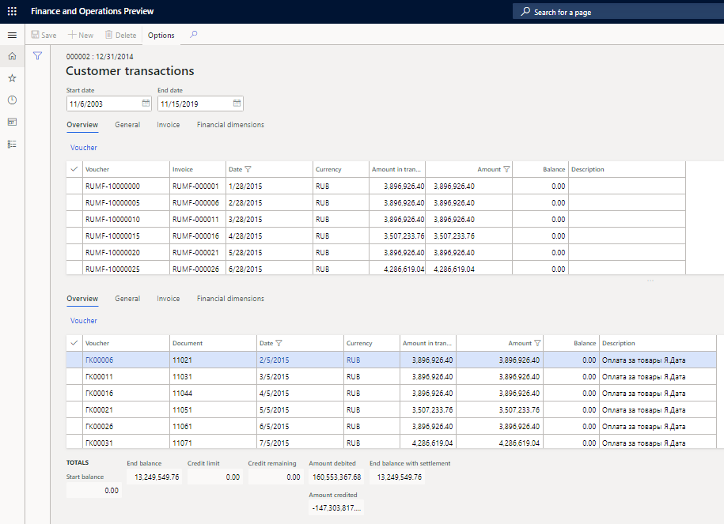
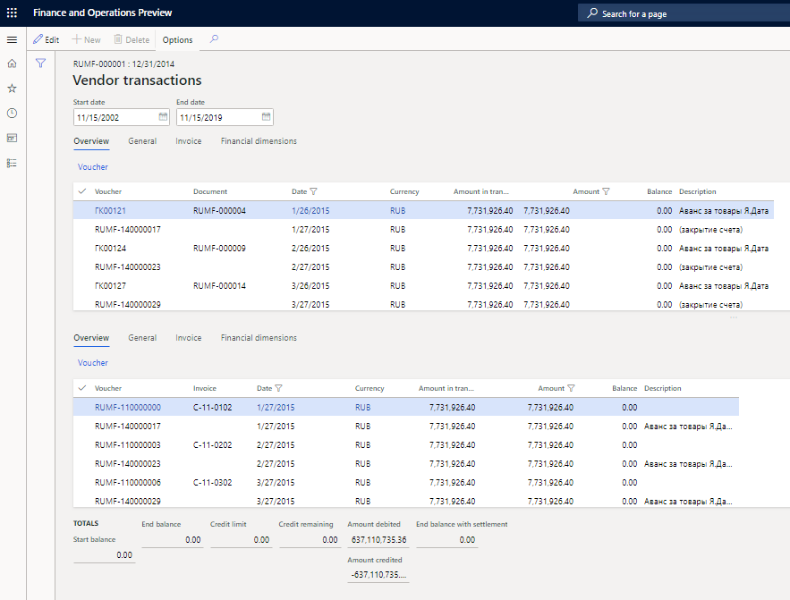
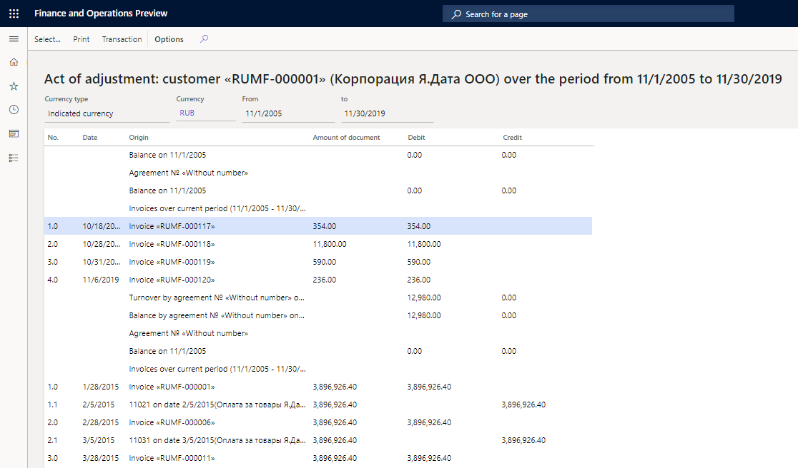

---
# required metadata
title: Inquiries and reports with agreements  
description: This topic provides information about restoring previously deducted VAT amounts for fixed assets.
author: v-nadyuz
manager: AnnBe
ms.date: 02/06/2020
ms.topic: article
ms.prod: 
ms.service: dynamics-ax-applications
ms.technology: 

# optional metadata

# ms.search.form:  
audience: Application User
# ms.devlang: 
ms.reviewer: kfend
# ms.tgt_pltfrm: 
# ms.custom: 
ms.search.region: Russia
# ms.search.industry: 
ms.author: roschlom
ms.search.validFrom: 2018-10-28
ms.dyn365.ops.version: 8.1

---

# Inquiries and reports with agreements
[!include [banner](../includes/banner.md)]

## Viewing agreement amounts

### View sales agreement amounts

1. On the **Sales agreements** page, select an agreement, and then, on the **Sales agreement** tab, in the **Related information** section, select **Agreement amount** to open the **Customer transactions** page.

    
   
2. In the **Start date** and **End date** fields, specify the period that you want to analyze agreement amounts for.
3. In the lower part of the page, in the **Totals** section, review thefollowing information:

     - The **Start balance** field shows the balance on the start date.
     - The **End balance** field shows the balance on the end date.
     - The **Amount debited** and **Amount credited** fields show the corresponding amounts under the agreement for the period.

4. In the upper and middle parts of the page, review the transactions on the counterparty for the debt that has occurred and for the repayment of that debt:

    - The **Amount** field shows the transaction amount.
    - The **Balance** field shows the undelivered amount.
    - The **Description** field shows the transaction description.

5. Select **Voucher** to view the ledger transactions.

### View purchase agreement amounts

1. On the **Purchase agreements** page, select an agreement, and then, on the **Purchase agreement** tab, in the **Related information** section, select **Agreement amount** to open the **Vendor transactions** page.

    

2. Review the amounts as described in the previous section of this topic, [View sales agreement amounts](#sales-agreement-amounts).

## Viewing orders and invoices that are linked to the agreement

### View sales orders and service invoices that are linked to sales agreements

1. On the **Sales agreements** page, select an agreement.
2. On the **Sales agreement** tab, in the **Related information** section, follow any of these steps:

    - Select **Linked sales orders** to view the details of the sales orders that are linked to the sales agreement.
    - Select **Linked services invoices** to view the details of the free text invoices that are linked to the sales agreement.
    - Select **Nonlinked sales orders** to view the details of the sales orders that are **not** linked to the sales agreement.
    - Select **Nonlinked services invoices** to view the details of the free text invoices that are **not** linked to the sales agreement.

### View purchase orders that are linked to purchase agreements

1. On the **Purchase agreements** page, select an agreement.
2. On the **Purchase agreement** tab, in the **Related information** section, follow any of these steps:

    - Select **Linked purchases** to view the details of the purchase orders that are linked to the purchase agreement.
    - Select **Nonlinked purchases** to view the details of the purchase orders that are **not** linked to the purchase agreement.

## Generating an Act of adjustment

An Act of adjustment is a document that is used to analyze settlements with the counterparty (customer or vendor). The parties that are involved agree on the recurrence of the document and its level of detail. The document contains information about accounts receivable or accounts payable at the beginning and end of the period, invoices that are issued or received, payments that are made, and netting transactions that are posted during the reporting period. An Act of adjustment can be generated in the context of invoices or agreements, or for the customer or vendor as a whole.

> [!NOTE]
> The settlement is the only basis for determining the timeliness of debt repayment, and for determining value-added tax (VAT), the tax base for income tax, and other details. Therefore, an Act of adjustment reflects the documents of debt repayment in the context of the documents that form the debt.

When generate an Act of adjustment, if the customer is a vendor at the same time, the total debt of the counterparty is estimated.

An Act of adjustment contains the following data in the context of the customer or vendor and its agreements:

   - The expanded total balance on the counterparty (agreement) at the beginning and the end of the period. The expanded total balance is the balance of invoices or credit notes, and the balance on advances or refunds.
   - Information about unpaid invoices of the previous period (payables or receivables), their payment, and their offset (settlement) in the current period.
   - Information about received or shipped invoices or credit notes for the period that is under review, together with information about their payment and netting (settlement).
   - Information about advances or refunds (unsettled payments of the current period).
   - Information about advances or refunds of past periods (unsettled payments of past periods).

### Generate an Act of adjustment for a customer

1.  Go to **Accounts receivable** \> **Inquiries and reports** \> **Act of adjustment**.

2.  In the **Counteragent** section, specify the following details:

    - In the **Customer account** field, select the customer to generate the Act of adjustment for.
    - If the counterparty is both a customer and a vendor at the same time, set the **Counteragent** parameter to **Yes** to create sections for both the customer and the associated vendor.
    - In the **Date interval code** field, select the code for the reporting period.
    - In the **From date** and **To date** fields, select the start and end dates of the reporting period.

3.  In the **Currency** section, specify the following details:

    - In the **Currency type** field, select the type of the transaction currency: **Accounting currency** or **Indicated currency**.
    - In the **Currency** field, select the transaction currency. This field is available only if you select **Indicated currency** in the **Currency type** field.

4.  In the **Setup** section, specify the following details:

    - Set the **By data of counteragent** option to **Yes** if you want data to be automatically entered in the section that is intended to be filled in by the counterparty.
    - Set the **Delete zero balance** option to **Yes** to exclude invoice balance lines from the report if they have a balance of 0 (zero) or a balance that equals the amount of the invoice.
    - Set the **Agreements** option to **Yes** to generate the Act of adjustment in the context of agreements.
    - Set the **Documents** option to **Yes** to generate the Act of adjustment in the context of documents that form debt.

5. Select **OK**.

    .png)

    > [!NOTE]
    > To view the customer transactions that have generated a line, select the line, and then, on the Action Pane, select **Transactions**. 
    >
    > To change the report parameters, on the Action Pane, select **Select**.
    >
    > To print the report, on the Action Pane, select **Print**.

### Generate an Act of adjustment for a vendor

1. Go to **Accounts receivable** \> **Inquiries and reports** \> **Act of adjustment**.
2. In the **Counteragent** section, in the **Vendor account** field, select the vendor to generate the Act of adjustment for.
3. Specify other details as described in the previous section of this topic, [Generate an Act of adjustment for a customer](#generate-act-adjustment-customer), and then select **OK**. After generate the report, you can also view vendor transactions, change the report parameters, and print the report.

Find more details in the following topics:

- [Agreements](rus-agreements.md)
- [Set up and create agreements](rus-set-up-and-create-agreements.md)
- [Register transactions with reference to agreements](rus-register-transactions-with-reference-to-agreements.md)
