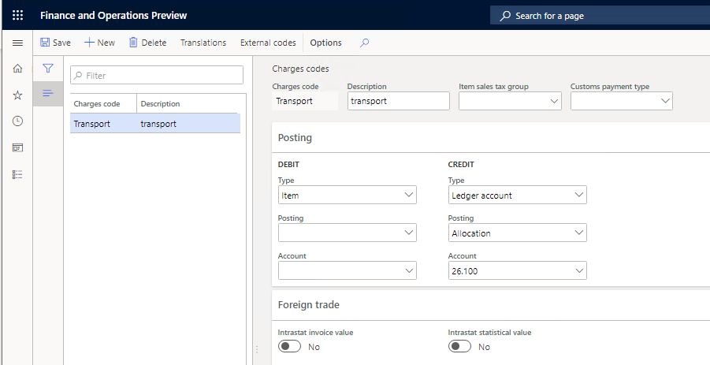
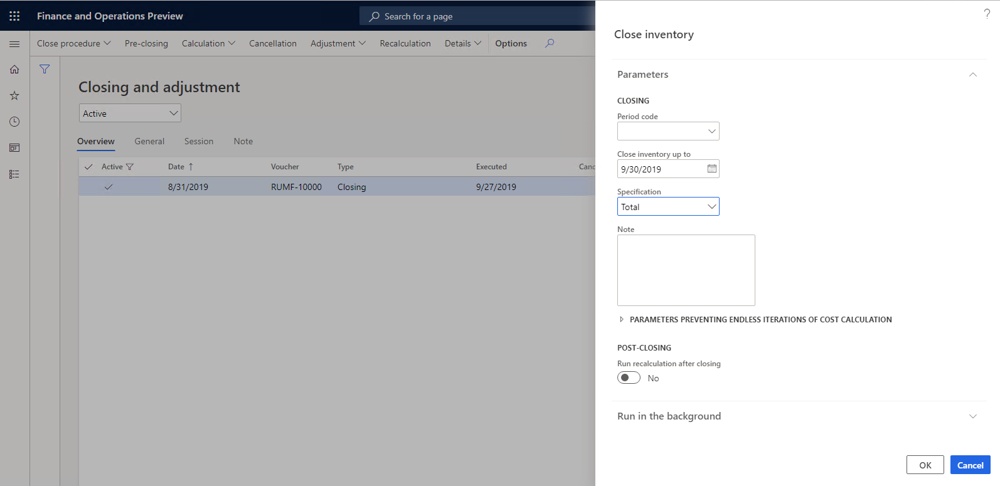
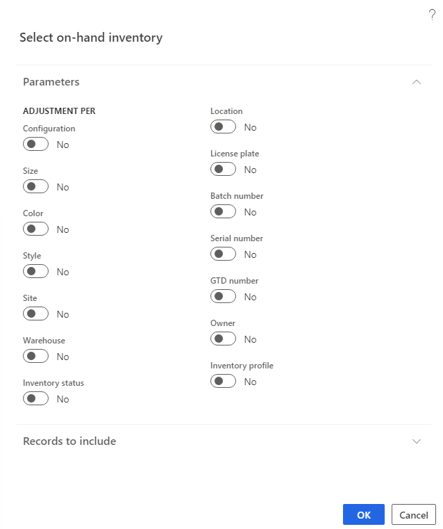
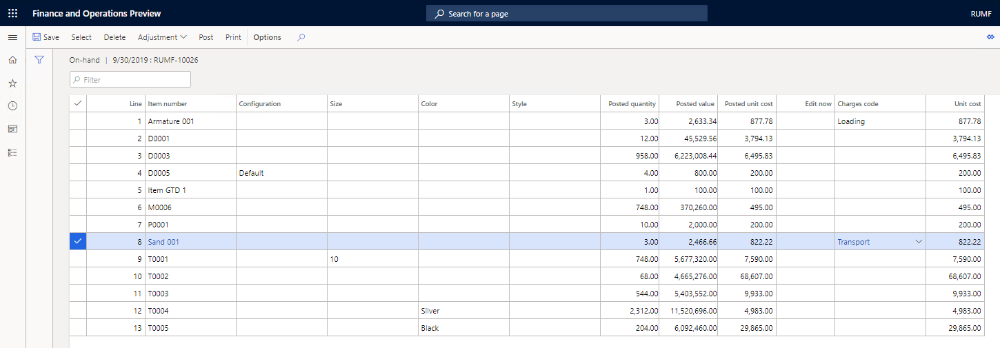
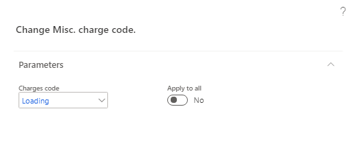
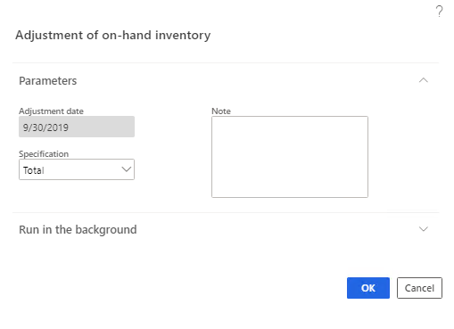
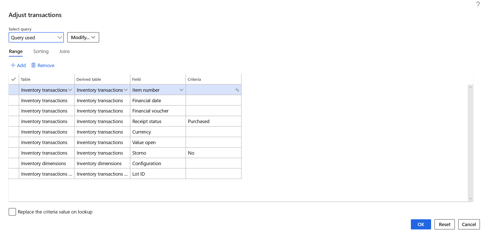
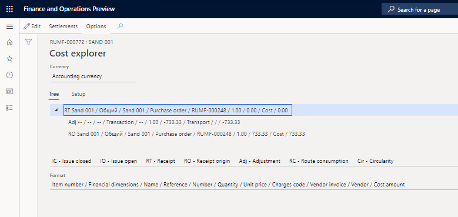

---
# required metadata
title: Inventory cost structure
description: This topic provides information about the inventory cost structure of miscellaneous charges in inventory transactions.
author: v-nadyuz
manager: AnnBe
ms.date: 02/05/2020
ms.topic: article
ms.prod: 
ms.service: dynamics-ax-applications
ms.technology: 

# optional metadata

# ms.search.form:  
audience: Application User
# ms.devlang: 
ms.reviewer: kfend
# ms.tgt_pltfrm: 
# ms.custom: 
ms.search.region: Russia
# ms.search.industry: 
ms.author: roschlom
ms.search.validFrom: 2018-10-28
ms.dyn365.ops.version: 8.1

---

# Inventory cost structure
[!include [banner](../includes/banner.md)]

You can save the item cost structure in inventory transactions as miscellaneous charges. You can then review the cost structure on the **Cost explorer** page. You can change the cost of inventory transactions by using the following functionality:

- Allocate miscellaneous charges from purchase orders and sales orders.
- Adjust the cost of inventory receipts by using the **Closing and adjustment** periodic operation.

When you allocate miscellaneous charges on a purchase order, inventory settlements are generated. You can then explore receipt inventory transactions in terms of miscellaneous charges codes. To work with the cost of inventory transactions, you must create a miscellaneous charges code for expense inventory transactions. The following system features are available for this purpose:

- Set the **Misc. charges structure** parameter to allow or disallow the creation of inventory settlements in terms of miscellaneous charges codes.
- Use the **Closing and adjustment** periodic operation to register a cost adjustment on inventory transactions or on-hand inventory that has miscellaneous charges codes.
- Use the **Cost explorer** page to view and explore a cost structure in terms of miscellaneous charges codes.

## Preliminary setup

### Set up the miscellaneous charges structure

1. Go to **Inventory management** \> **Setup** \> **Inventory and warehouse management parameters**.
2. On the **General** tab, in the **Correction** section, set the **Misc. charges structure** option:

    - If you set this option to **No**, one settlement transaction, for the total amount, is generated for each receipt transaction. The miscellaneous charges code isn't entered in the inventory settlement.
    - If you set this option to **Yes**, inventory settlements are generated as miscellaneous charges codes when you post a purchase invoice.

### Set up a charges code in Inventory management

1. Go to **Inventory management** \> **Setup** \> **Charges** \> **Charges codes**.
2. Create a charges code. Charges codes that you create in the **Inventory management** module have the following configuration limitations:

    - In the **Type** field in the **Debit** section, you can select only **Item**.
    - In the **Type** field in the **Credit** section, you can select only **Ledger account**.

## Adjustment of item cost in terms of miscellaneous charges codes

In the **Inventory management** module, miscellaneous charges can be allocated in several ways:

- Manually adjust on-hand inventory.
- Manually adjust transactions.
- Adjust on-hand inventory or transactions by using a wizard.

You can specify existing miscellaneous charges codes when you adjust item cost on the **On-hand**, **Adjust transactions**, and **Wizard for cost value adjustment of inventory transactions or entire on-hand inventory** pages.

### Close inventory

Before you adjust on-hand inventory, you must close the inventory. For more information about inventory closing, see [Inventory close](../../supply-chain/cost-management/inventory-close.md).

1. Go to **Inventory management** \> **Periodic tasks** \> **Closing and adjustment**.
2. On the Action Pane, select **Close procedure** \> **Close inventory**.
3. In the **Close inventory** dialog box, in the **Close inventory up to** field, specify the date that the inventory will be closed by.
4. In the **Specification** field, select **All**.

    

5. Select **OK**.

### Cancel inventory closing

Before you can adjust transactions, you must verify that the inventory wasn't closed.

1.  Go to **Inventory management** \> **Periodic tasks** \> **Closing and adjustment**.
2.  Select the inventory closing operation, and then, on the Action Pane, select **Cancellation**.
3.  In the **Cancellation – initialize** dialog box, select **OK**.

### Adjust on-hand inventory

For more information about the adjustment of on-hand inventory, see [Adjust on-hand inventory cost values](../../supply-chain/cost-management/adjust-hand-inventory-cost-values.md).

1.  Close the inventory as described in the [Close inventory](#close-inventory) section earlier in this topic.
2.  Go to **Inventory management** \> **Periodic tasks** \> **Closing and adjustment**.
3.  On the Action Pane, select **Adjustment \> On-hand**.
4.  On the Action Pane, select **Select**.
5.  In the **Select on-hand inventory** dialog box, specify the inventory dimensions that should be shown after the adjustment is done.

    

6.  Select **OK**. The **On-hand** page shows the inventory lines that you selected for adjustment, together with the specified inventory dimensions.
7.  Select the line for an item, and then, in the **Charges code** field, select a charges code for the item. The selected miscellaneous charge code is entered in the inventory settlement after the adjustment is posted.

    

8.  To enter the charges code on all lines of the **On hands** page, on the Action Pane, select **Adjustment** \> **Charges code**.
9.  In the **Change Misc. charge code** dialog box, set the following values:

    - In the **Charges code** field, select a charges code.
    - Set the **Apply to all** option to **Yes**. If this option is set to **No**, the value in the **Charges code** field will be adjusted only on the line that is selected on the **On hands** page.

    

10. Select **OK**.
11. On the Action Pane, select **Post**.
12. In the **Adjustment of on-hand inventory** dialog box, in the **Specification** field, select how transaction adjustments are posted:

    - **Total** – Adjustments are posted for all items that have the same settings in the posting profile.
    - **Item group** – Adjustments are posted for all items that have the same item group.
    - **Item number** – Adjustments are posted for each item.

13. In the **Note** field, enter a note about the adjustment.

    

14. Select **OK** to post the adjustment.

When you post an adjustment, the general ledger offset account is defined in the following way:

   - If the miscellaneous charges code is entered on the item line, the adjustment is posted to the offset account that is set up for the miscellaneous charges code.
   - If the miscellaneous charges code isn't entered on the item line, the adjustment is assigned to the offset profit or loss account that is set up on the **Inventory tab** of the **Posting** page (**Inventory management** \> **Setup** \> **Posting** \> **Posting**).

### Adjust transactions

1. Verify that the inventory wasn't closed. If it was closed, cancel the inventory closing as described in the [Cancel inventory closing](#cancel-inventory-closing) section earlier in this topic.
2. Go to **Inventory management** \> **Periodic tasks** \> **Closing and adjustment**.
3. On the Action Pane, select **Adjustment** \> **Transactions**.
4. On the Action Pane, select **Select**.
5. In the **Adjust transactions** dialog box, specify selection criteria for the inventory receipt transactions that must be adjusted, and then select **OK**.

    

6. Select charges codes for items, and post the adjustment, as described in the [Adjust on-hand inventory](#adjust-on-hand-inventory) section earlier in this topic. The general ledger offset account will be defined according to the same principle.

### Use a wizard to adjust item cost 

For more information, see [Inventory adjustment wizard](rus-inventory-adjustment-wizard.md).

1. Go to **Inventory management** \> **Periodic tasks** \> **Closing and adjustment**.
2. On the Action Pane, select **Adjustment** \> **Wizard**.
3. On the **Welcome** page, select **Next**.
4. On the **Method of cost value adjustment** page, select the method of adjustment:

    - **On-hand** – Adjust on-hand inventory.
    - **Transactions** – Adjust transactions.

5. Select **Next**. Either the **Select on-hand inventory** page or the **Adjust transactions** page appears, depending on the method of adjustment that you selected.
6. Specify selection criteria, and then select **OK**.
7. On the **Selection result** page, review the items or item transactions that have been selected for adjustment, and then select **Next**.

    

8. On the **Functions for calculating adjustment amounts** page, select the method for calculating adjustment amounts, and then select **Next**.

    

9. On the **Results of allocation** page, review the allocation results. In the **Charges code** field, select a charge code for a line.

    

10. Select **Next**.
11. On the **Posting** page, specify the details for posting the adjustment:

   - In the **Adjustment date** field, specify the date of the adjustment.
   - In the **Specification** field, select how transaction adjustments are posted:

     - **Total** – Adjustments are posted for all items that have the same settings in the posting profile.
     - **Item group** – Adjustments are posted for all items that have the same item group.
     - **Item number** – Adjustments are posted for each item.
   - Set the **Corr. account profit/loss** option and the **Corr. account** field, depending on the account that an adjustment should be assigned to during posting:

     - If the miscellaneous charges code is entered on the item line, the adjustment will be assigned to the offset account that is set up for the miscellaneous charges code.
     - If the miscellaneous charges code isn't entered on the item line, and if the **Corr. account profit/loss** option on the **Posting** page is set to **Yes**, the adjustment will be assigned, in the usual way, to the offset profit or loss account that is set up on the **Inventory** tab of the **Posting** page (**Inventory management \> Setup \> Posting \> Posting**).
     - If the miscellaneous charges code isn't entered on the item line, and if the **Corr. account profit/loss** option on the **Posting** page is set to **No**, the adjustment will be assigned to the account that is specified in the **Corr. account** field.

   

12. Select **Next**.
13. On the **Finish** page, select the **Show ledger voucher list** check box to show the ledger voucher list.
14. Select **Finish** to post the adjustment.

## View item cost structure in the inventory settlements and cost explorer

On the **Settlements** page, you can view inventory cost adjustment transactions. As a result of inventory closing, receipt transactions are settled against issue transactions. After inventory closing is completed, you can open the **Cost explorer** page to view and explore the item cost structure in terms of miscellaneous charges.

1. Close the inventory as described in the [Close inventory](#close-inventory) section earlier in this topic.
2. Go to **Product information management** \> **Products** \> **Released products**.
3. On the **Released products details** page, select an item, and then, on the Action Pane, on the **Manage Costs** tab, in the **Cost transactions** group, select **Transactions**.
4. On the **Inventory transactions** page, select the transaction on the receipt item that you want to explore the cost structure for. Then, on the Action Pane, on the **Inventory** tab, in the **Costing** group, select **Settlements**.
5. On the **Settlements** page, review the following information:

    - The **Charges code** field shows the miscellaneous charges code that has been allocated to the item receipt transaction.
    - The **Vendor account** field shows the account of the vendor that the miscellaneous charges were bought from. For more information about how to buy miscellaneous charges from a third-party vendor, see [Third party miscellaneous charges](rus-third-party-misc-charges.md).

    - The **Invoice** field shows the invoice number of the miscellaneous chargespurchase.

    > [!NOTE]
    > If the **Vendor account** and **Invoice** fields are blank, the standard method of miscellaneous charges allocation was used to perform the cost adjustment operation.

    

6. On the **Inventory transactions** page, on the Action Pane, on the **Inventory** tab, in the **Costing** group, select **Cost explorer**.

    

On the **Settlements** and **Cost explorer** pages, the miscellaneous charges codes that have the **Item** debit type and the **Ledger account** credit type are shown as a separate line. The miscellaneous charges codes that have other debit and credit types are included in the item cost price as direct charges (standard functionality). They aren't allocated on the **Settlements** page. Therefore, they aren't shown as a separate line on the **Cost explorer** page.

If the **Charges code** field on the **Settlements** page isn't set, a charges code won't be shown on the **Cost explorer** page. If the **Charges code** field on the **Settlements** page is set, the charges code will be shown as a separate line on the **Cost explorer** page.
