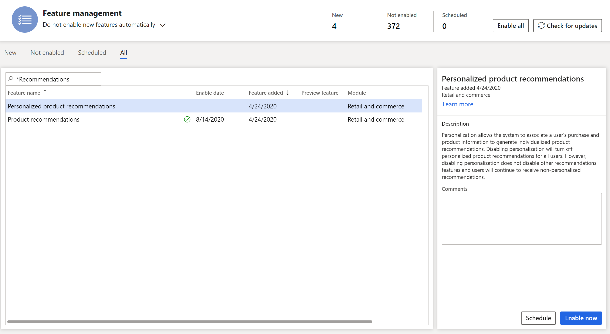
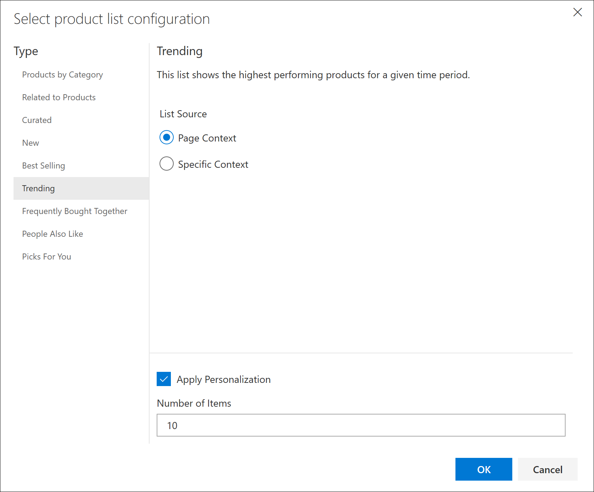

# Personalisierte Produktempfehlungen aktivieren

[!include [banner](includes/banner.md)]

In diesem Thema wird beschrieben, wie Kunden in Microsoft personalisierte Produktempfehlungen zur Verfügung gestellt werden Dynamics 365 Commerce.

## Übersicht

In Dynamics 365 Commerce können Einzelhändler können Produktempfehlungen (auch als Personalisierung bezeichnet) zur Verfügung stellen. Auf diese Weise können personalisierte Empfehlungen online und am Point of Sale (POS) in das Kundenerlebnis einbezogen werden. Wenn die Personalisierungsfunktion aktiviert ist, kann das System die Kauf- und Produktinformationen eines Benutzers verknüpfen, um individuelle Produktempfehlungen zu generieren.

## Personalisierungsvoraussetzungen

Beachten Sie, dass Produktempfehlungen nur für Commerce-Benutzer unterstützt werden, die ihren Speicher auf Azure Data Lake Store migriert haben, bevor Sie Kunden personalisierte Produktempfehlungen zur Verfügung stellen. Bevor Kunden personalisierte Produktempfehlungen erhalten können, müssen Einzelhändler [Produktempfehlungen einschalten](enable-product-recommendations.md).

> [!NOTE]
> Wenn Sie Produktempfehlungen aktivieren, aktivieren Sie auch die Personalisierung. Wenn Sie jedoch die Personalisierung deaktivieren, werden die anderen Produktempfehlungen nicht deaktiviert.

Weitere Informationen zu Produktempfehlungen finden Sie im [Produktempfehlungsüberblick](product-recommendations.md).

## Personalisierungen einschalten

Um die Personalisierung einzuschalten, führen Sie diese Schritte aus.

1. In der Commerce-Zentrale suchen Sie nach **Funktionsverwaltung**.
1. Wählen Sie **Alles** aus, um eine Liste der verfügbaren Funktionen anzuzeigen. 
1. Geben Sie im Suchfeld **Empfehlungen** ein.
1. Wählen Sie die Funktion **Personalisierte Produktempfehlungen** aus.
1. Wählen sie im Eigenschaftsbereich **Personalisierte Produktempfehlungen** die Option **Jetzt aktivieren** aus.

> [!NOTE]
> Wenn Sie die Personalisierung aktivieren, wird der Prozess zum Generieren personalisierter Produktempfehlungslisten gestartet. Es kann bis zu einem Tag dauern, bis diese Listen online und am POS verfügbar und sichtbar sind.

## Personalisierte Listen

Der Empfehlungsservice ermöglicht nicht nur die Personalisierung vorhandener maschinengenerierter Listen, sondern ermöglicht auch die Personalisierung der Produkterkennungserfahrung sowohl online als auch am POS.

Nach dem Aktivieren der Personalisierung können Einzelhändler Kunden personalisierte Für Sie ausgewählt-Listen online oder Für Kunden empfohlen-Listen auf POS-Terminals anzeigen. Darüber hinaus können Einzelhändler vorhandene Produktempfehlungslisten personalisieren und authentifizierten Benutzern die Möglichkeit zum Deaktivieren gemäß der allgemeinen Datenschutzverordnung (DSGVO) bieten. Wenn Sie die Personalisierung deaktivieren, deaktivieren Sie auch diese Funktionen.

### Online Für Sie Ausgewählt-Listen

Eine Für Sie Ausgewählt-Liste ist eine Liste für künstliches Intelligenz-Maschinelles Lernen (KI-ML), die einem authentifizierten Benutzer eine personalisierte Liste vorgeschlagener Produkte anzeigt. Diese Liste basiert auf dem Omnikanal-Kaufverlauf des Benutzers. Personalisierte Empfehlungen werden dynamisch aktualisiert, wenn der Benutzer mehr Einkäufe tätigt. Dieser Listentyp unterstützt auch die Kategoriefilterung, sodass Einzelhändler Top-Picks basierend auf Navigationshierarchien anzeigen können.

Bevor die Liste Tipps für Sie auf einer E-Commerce-Seite angezeigt werden kann, müssen die folgenden Benutzeranforderungen erfüllt sein:

- Benutzer müssen angemeldet sein. Anonyme Benutzer sehen keine personalisierten Empfehlungen.
- Benutzer müssen mindestens einen Kauf auf ihrem Konto haben.
- Benutzer müssen sich anmelden, um personalisierte Empfehlungen zu erhalten.

Die folgende Abbildung zeigt ein Beispiel für eine Liste Tipps für Sie auf einer Online-Shop-Seite.

### Empfohlen für Kunden-Listen am POS

Um das Kundenerlebnis zu verbessern, können Einzelhändler vorhandene Kundendetailseiten durch Hinzufügen einer kontextbezogenen Liste Empfohlen für Kunden personalisieren.

Die folgende Abbildung zeigt ein Beispiel für eine Liste Tipps für Sie auf einem POS-Terminal.

## Übernehmen Sie die Personalisierung für vorhandene Empfehlungslisten

Einzelhändler können vorhandene Empfehlungslisten wie Neu, Trend, Bestseller, Leute mögen auch und Häufig zusammen gekauft personalisieren. Wenn die Personalisierung auf vorhandene Listen angewendet wird, werden Elemente, die ein angemeldeter Benutzer zuvor gekauft hat, aus diesen Listen entfernt. Sowohl für anonyme Benutzer als auch für Benutzer, die keine personalisierten Empfehlungen erhalten haben, werden Standardversionen der vorhandenen Listen angezeigt. Daher müssen Einzelhändler separate Seitenerfahrungen nicht manuell verwalten.

Ein angemeldeter Benutzer hat beispielsweise bereits die schwarze Uhr und die braunen Arbeitsstiefel gekauft, die in der Liste Trend – Standard in der folgenden Abbildung aufgeführt sind. Daher werden dem Benutzer anstelle dieser Produkte neue Produkte angezeigt, wie in der Liste Trend – personalisiert gezeigt.

Gehen Sie folgendermaßen vor, um eine vorhandene Empfehlungsliste in dem Commerce-Site-Generator zu personalisieren.

1. Öffnen Sie eine vorhandene Site Builder-Seite, die ein Produktsammlungsmodul enthält.
1. Wählen Sie im linken Navigationsbereich Produktsammlungsmodul aus.
1. Wählen Sie im rechten Navigationsbereich unter **Produkte** die Liste aus.
1. In dem **Produktlistenkonfiguration auswählen** Dialogfeld unter **Typ** wählen Sie den Listentyp.
1. Wählen Sie das Kontrollkästchen **Personalisierung anwenden** und wählen Sie dann **OK** aus.

    

1. Speichern Sie das Seitenfragment, beenden Sie die Bearbeitung und veröffentlichen Sie sie. Nachdem die Seite veröffentlicht wurde, sehen angemeldete Benutzer personalisierte Trendlisten.

## Zusätzliche Ressourcen

[Überblick über Produktempfehlungen](product-recommendations.md)

[Aktivieren von Azure Data Lake Storage in einer Dynamics 365 Commerce Umgebung](enable-adls-environment.md)

[Produktempfehlungen aktivieren](enable-product-recommendations.md)

[Die Empfehlungen „Produkte mit ähnlichem Aussehen kaufen“ aktivieren](shop-similar-looks.md)

[Personalisierte Empfehlungen kündigen](personalization-gdpr.md)

[Produktempfehlungen am POS hinzufügen](product.md)

[Empfehlungen zum Transaktionsbildschirm hinzufügen](add-recommendations-control-pos-screen.md)

[Anpassung der Ergebnisse der AI-ML-Empfehlungen](modify-product-recommendation-results.md)

[Manuell kuratierte Empfehlungen erstellen](create-editorial-recommendation-lists.md)

[Empfehlungen mit Demodaten erstellen](product-recommendations-demo-data.md)

[Produktempfehlungs-FAQs](faq-recommendations.md)
