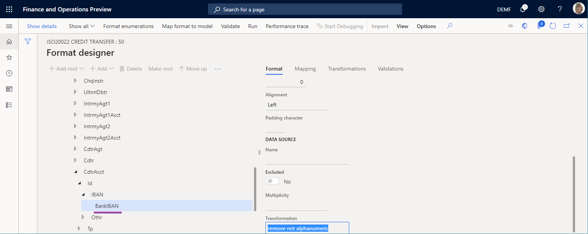
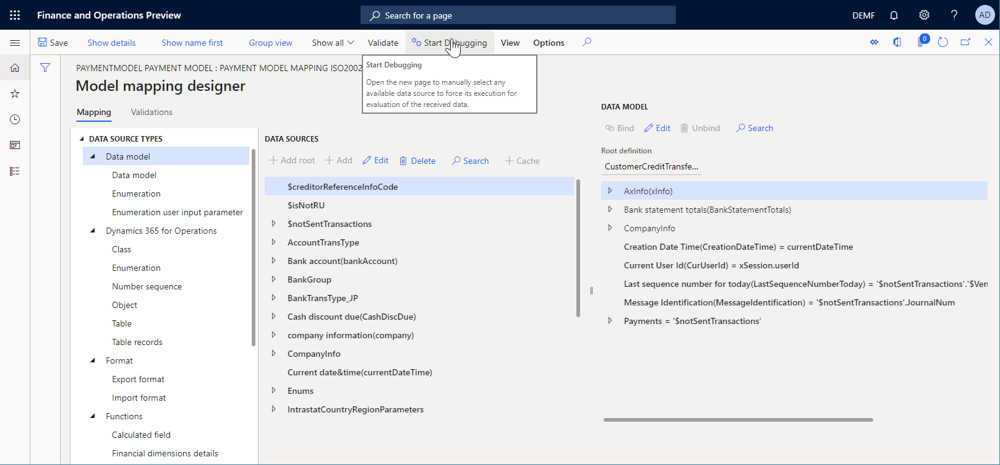
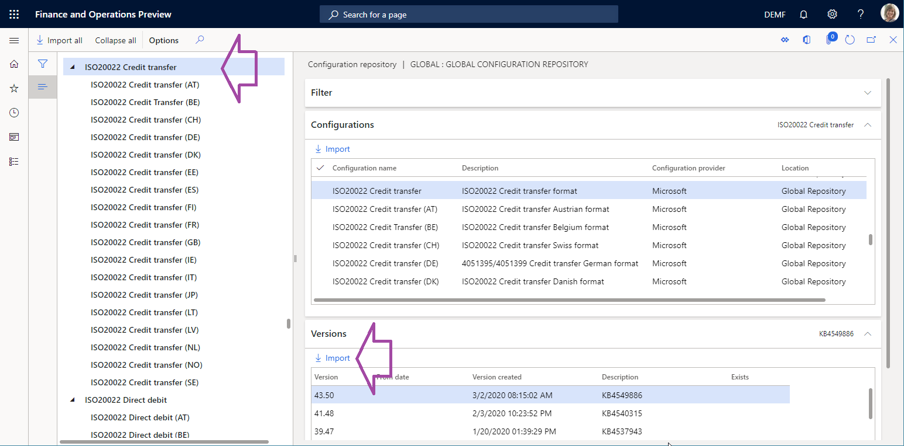
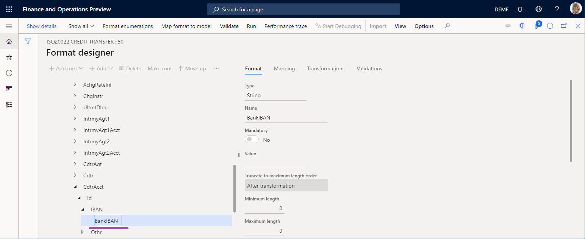
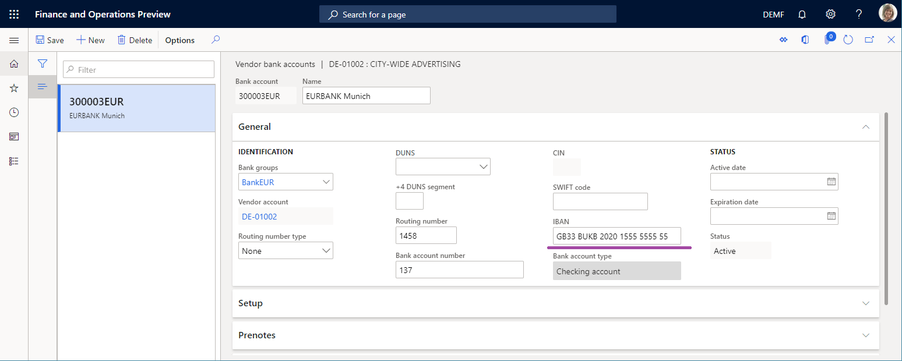

# Debuggen Sie Datenquellen eines ausgeführten EB-Formats, um den Datenfluss und die Transformation zu analysieren

[!include[banner](../includes/banner.md)]

[!include[banner](../includes/preview-banner.md)]

Wenn Sie eine elektronische Berichterstellungs-(EB)-Lösung [konfigurieren](tasks/er-format-configuration-2016-11.md), um ausgehende Dokumente zu generieren, definieren Sie Methoden, die verwendet werden, um Daten aus der Anwendung abzurufen und sie in die Ausgabe einzugeben, die generiert wird. Um die Lebenszyklusunterstützung der EB-Lösung effizienter zu gestalten, sollte Ihre Lösung aus einem EB-[Datenmodell](general-electronic-reporting.md#DataModelComponent) und deren [Zuordnung](general-electronic-reporting.md#ModelMappingComponent)-Komponenten bestehen und auch einem EB-[Format](general-electronic-reporting.md#FormatComponentOutbound) und dessen Zuordnungskomponenten bestehen, sodass die Modellzuordnung anwendungsspezifisch ist, wohingegen andere Komponenten anwendungsunabhängig bleiben. Daher [beeinflussen](general-electronic-reporting.md#FormatComponentOutbound) möglicherweise mehrere EB-Komponenten den Prozess der Dateneingabe in die generierte Ausgabe.

Manchmal sehen die Daten der generierten Ausgabe anders aus als die gleichen Daten in der Anwendungsdatenbank. In diesen Fällen möchten Sie bestimmen, welche EB-Komponente für die Datentransformation verantwortlich ist. Die EB-Datenquellendebugger-Funktion reduziert den Zeit- und Kostenaufwand für diese Untersuchung erheblich. Sie können die Ausführung eines EB-Formats unterbrechen und die Datenquellendebugger-Schnittstelle öffnen. Dort können Sie die verfügbaren Datenquellen durchsuchen und eine einzelne Datenquelle für die Ausführung auswählen. Diese manuelle Ausführung simuliert die Ausführung der Datenquelle während der realen Ausführung eines EB-Formats. Das Ergebnis wird auf einer Seite dargestellt, auf der Sie die empfangenen Daten analysieren können.

Um die Datenquellendebug-Funktion zu aktivieren, legen Sie in den EB-Benutzerparametern die Option **Datendebuggen bei Formatausführung aktivieren** auf **Ja** fest. Sie können dann mit dem Debuggen von Datenquellen beginnen, während Sie ein EB-Format ausführen, um ausgehende Dokumente zu generieren. Sie können auch die Option **Debuggen starten** verwenden, um das Datenquellendebuggen für ein EB-Format zu initiieren, das im [EB-Vorgangs-Designer](./tasks/er-format-configuration-2016-11.md#design-the-format-of-an-electronic-document) konfiguriert ist.

Dieses Thema enthält Richtlinien zum Initiieren des Datenquellendebuggens für ausgeführte EB-Formate. Es wird erläutert, wie die Informationen Ihnen helfen können, den Datenfluss und die Datentransformationen zu verstehen. In den Beispielen in diesem Thema wird der Geschäftsprozess für die Verarbeitung von Lieferantenzahlungen verwendet.

## Einschränkungen

Der Datenquellen-Debugger kann verwendet werden, um auf die Daten von Datenquellen zuzugreifen, die in EB-Formaten verwendet werden, die zum Generieren ausgehender Dokumente ausgeführt werden. Er kann nicht zum Debuggen von Datenquellen in EB-Formaten verwendet werden, mit denen eingehende Dokumente analysiert werden sollen.

Auf die folgenden Einstellungen von EB-Formaten kann derzeit für das Debuggen von Datenquellen nicht zugegriffen werden:

- Format-Transformationen
- Validierungsregeln für Format und Zuordnung
- Ausdrücke aktivieren
- Details zur speicherinternen Datenerfassung

## Voraussetzungen

- Um die Beispiele in diesem Thema abzuschließen, müssen Sie den Zugriff auf eine der folgenden [Rollen](../sysadmin/tasks/assign-users-security-roles.md) haben:

    - Entwickler für elektronische Berichterstellung
    - Funktionaler Berater für elektronische Berichterstellung
    - Systemadministrator

- Das Unternehmen muss auf **DEMF** festgelegt sein.

- Folgen Sie den Schritten in [Anhang 1](#appendix1) dieses Themas, um die Komponenten der Microsoft EB-Lösung herunterzuladen, die zum Verarbeiten von Lieferantenzahlungen erforderlich sind.
- Folgen Sie den Schritten in [Anhang 2](#appendix2) dieses Themas, um die Kreditorenkonten für die Verarbeitung von Kreditorenzahlungen mithilfe der von Ihnen heruntergeladenen EB-Lösung vorzubereiten.

## Verarbeiten einer Lieferantenzahlung, um eine Zahlungsdatei abzurufen

1. Folgen Sie den Schritten in [Anhang 3](#appendix3) dieses Themas, um Kreditorenzahlungen zu verarbeiten.

    

2. Laden Sie die ZIP-Datei auf Ihren lokalen Computer herunter und speichern Sie sie.
3. Extrahieren Sie die Zahlungsdatei **ISO20022 Credit transfer.xml** aus der ZIP-Datei.
4. Öffnen Sie die extrahierte Zahlungsdatei mit der XML-Dateianzeige.

    In der Zahlungsdatei enthält der IBAN-Code (International Bank Account Number) des Kreditorenbankkontos keine Leerzeichen. Daher unterscheidet es sich von dem Wert, der [eingegeben](#enteredIBANcode) wurde auf der Seite **Bankkonten**.

    

    Mit dem EB-Datenquellendebugger können Sie erfahren, welche Komponente der EB-Lösung zum Abschneiden von Leerzeichen im IBAN-Code verwendet wird.

## Aktivieren Sie das Debuggen von Datenquellen

1. Wechseln Sie zu **Organisationsverwaltung** \> **Elektronische Berichterstellung** \> **Konfigurationen**.
2. Auf der Seite **Konfigurationen** im Aktivitätsbereich, auf der Registerkarte **Konfigurationen** in der Gruppe **Erweiterte Einstellungen** wählen Sie **Benutzerparameter** aus.
3. Legen Sie die Option **Debuggen von Daten beim Ausführen des Formats** auf **Ja** fest.

    > [!NOTE]
    > Dieser Parameter ist benutzerspezifisch und unternehmensspezifisch.

    

## Verarbeiten einer Kreditorenzahlung zum Debuggen

1. Folgen Sie den Schritten in [Anhang 3](#appendix3) dieses Themas, um Kreditorenzahlungen zu verarbeiten.
2. Wählen Sie im Meldungsfeld **Ja** aus, um zu bestätigen, dass Sie die Kreditorenzahlungsabwicklung unterbrechen und stattdessen das Debuggen von Datenquellen auf der Seite **Debuggen von Datenquellen** starten möchten.

    

## Debuggen von Datenquellen, die bei der Zahlungsabwicklung verwendet werden

### Debuggen der Modellzuordnung

1. Auf der Seite **Debuggen von Datenquellen** wählen Sie im Aktionsbereich die Option **Modellzuordnung** aus, um mit dem Debuggen ab dieser EB-Komponente zu beginnen.
2. Wählen Sie im Datenquellenbereich links die Datenquelle **\$notSentTransactions** aus, und wählen Sie dann **Alle Datensätze lesen** aus.

    Sie können **1 Datensatz lesen**, **10 Datensätze lesen**, **100 Datensätze lesen** oder **Alle Datensätze lesen** auswählen, um das Lesen der entsprechenden Anzahl von Datensätzen aus der ausgewählten Datenquelle zu erzwingen. Auf diese Weise können Sie den Zugriff auf die Datenquelle aus EB-Format simulieren, das gerade ausgeführt wird.

3. Wählen Sie im Datenbereich rechts die Option **Alle erweitern** aus.

    Sie können sehen, dass die ausgewählte Datenquelle des Typs **Datensatzliste** einen einzelnen Datensatz enthält.

4. Erweitern Sie die Datenquelle **\$notSentTransactions**, und wählen Sie die geschachtelte Methode **vendBankAccountInTransactionCompany()** aus.
5. Erweitern Sie die Methode **vendBankAccountInTransactionCompany ()**, und wählen Sie das geschachtelte Feld **IBAN** aus.
6. Wählen Sie **Wert abrufen**.

    Sie können **Wert abrufen** auswählen, um das Lesen des Werts eines ausgewählten Felds der ausgewählten Datenquelle zu erzwingen. Auf diese Weise können Sie den Zugriff auf dieses Feld aus dem EB-Format simulieren, das gerade ausgeführt wird.

7. Wählen Sie **Alle erweitern** aus.

    

    Wie Sie sehen, ist die Modellzuordnung nicht für die abgeschnittenen Leerzeichen verantwortlich, da der IBAN-Code, den sie für das Bankkonto des Kreditors zurückgibt, Leerzeichen enthält. Daher müssen Sie das Datenquellen-Debuggen fortsetzen.

### Formatzuordnung debuggen

1. Auf der Seite **Debuggen von Datenquellen** wählen Sie im Aktionsbereich die Option **Formatzuordnung** aus, um mit dem Debuggen ab dieser EB-Komponente fortzufahren.
2. Wählen Sie die Datenquelle **\$PaymentByDebtor** aus, und wählen Sie dann **Alle Datensätze lesen** aus.
3. Erweitern Sie **\$PaymentByDebtor**.
4. Erweitern Sie **\$PaymentByDebtor.Lines**, und wählen Sie dann **Alle Datensätze auswählen** aus.
5. Erweitern Sie **\$PaymentByDebtor.Lines.CreditorAccount**.
6. Erweitern Sie **\$PaymentByDebtor.Lines.CreditorAccount.Identification**, und wählen Sie dann **\$PaymentByDebtor.Lines.CreditorAccount.Identification.IBAN** aus.
7. Wählen Sie **Wert abrufen**.
8. Wählen Sie **Alle erweitern** aus.

    

    Wie Sie sehen, sind die Datenquellen der Modellzuordnung nicht für die abgeschnittenen Leerzeichen verantwortlich, da der IBAN-Code, den sie für das Bankkonto des Kreditors zurückgeben, Leerzeichen enthält. Daher müssen Sie das Datenquellen-Debuggen fortsetzen.

### Das Format debuggen

1. Auf der Seite **Debuggen von Datenquellen** wählen Sie im Aktionsbereich die Option **Format** aus, um mit dem Debuggen ab dieser EB-Komponente fortzufahren.
2. Erweitern Sie die auszuwählenden Formatelemente **ISO20022CTReports** \> **XMLHeader** \> **Dokument** \> **CstmrCdtTrfInitn** \> **PmtInf**, und wählen Sie dann **Alle Datensätze lesen** aus.
3. Erweitern Sie die auszuwählenden Formatelemente **ISO20022CTReports** \> **XMLHeader** \> **Dokument** \> **CstmrCdtTrfInitn** \> **PmtInf** \> **CdtTrfTxInf**, und wählen Sie dann **Alle Datensätze lesen** aus.
4. Erweitern Sie die auszuwählenden Formatelemente **ISO20022CTReports** \> **XMLHeader** \> **Dokument** \> **CstmrCdtTrfInitn** \> **PmtInf** \> **CdtTrfTxInf** \> **CdtrAcct** \> **Id** \> **IBAN** \> **BankIBAN**, und wählen Sie dann **Wert abrufen** aus.
5. Wählen Sie **Alle erweitern** aus.

    

   Wie Sie sehen, ist die Formatbindung nicht für die abgeschnittenen Leerzeichen verantwortlich, da der IBAN-Code, den sie für das Bankkonto des Kreditors zurückgibt, Leerzeichen enthält. Deshalb ist das Element **BankIBAN** so konfiguriert, dass eine Format-Transformation verwendet wird, bei der Leerzeichen abgeschnitten werden.

6. Schließen Sie den Datenquellen-Debugger.

### Überprüfen Sie die Format-Transformationen

1. Wechseln Sie zu **Organisationsverwaltung** \> **Elektronische Berichterstellung** \> **Konfigurationen**.
2. Auf der Seite **Konfigurationen** wählen Sie **Zahlungsmodell** \> **ISO20022-Kreditübertragung**.
3. Wählen Sie **Designer** aus, und erweitern Sie dann die Elemente, um **Dokument** \> **CstmrCdtTrfInitn** \> **PmtInf** \> **CdtTrfTxInf** \> **CdtrAcct** \> **Id** \> **IBAN** \> **BankIBAN** auszuwählen.

    

    Wie Sie sehen können, ist das Element **BankIBAN** so konfiguriert, dass es die Transformation **nicht alphanumerisch entfernen** verwendet.

4. Wählen Sie die Registerkarte **Transformationen** aus.

    

    Wie Sie sehen können, ist die Transformation **nicht alphanumerisch entfernen** so konfiguriert, dass ein Ausdruck verwendet wird, der Leerzeichen aus der bereitgestellten Textzeichenfolge abschneidet.

## Debuggen im Vorgangs-Designer starten

Wenn Sie eine Entwurfsversion des EB-Formats konfigurieren, das direkt vom Vorgangs-Designer ausgeführt werden kann, können Sie auf den Datenquellen-Debugger zugreifen, indem Sie **Debuggen starten** im Aktionsbereich auswählen.

Die Formatzuordnung und Formatkomponenten des EB-Formats, das gerade bearbeitet wird, stehen zum Debuggen zur Verfügung.

## Debuggen im Modellzuordnungs-Designer starten

Wenn Sie eine EB-Modellzuordnung konfigurieren, die direkt von der Seite **Modellzuordnung** ausgeführt werden kann, können Sie auf den Datenquellen-Debugger zugreifen, indem Sie **Debuggen starten** im Aktionsbereich auswählen.

Die Modellzuordnungskomponente der zu bearbeitenden EB-Zuordnung steht zum Debuggen zur Verfügung.

## Anhang 1: Eine EB-Lösung abrufen

### Eine EB-Lösung herunterladen

Wenn Sie eine EB-Lösung verwenden möchten, um eine elektronische Zahlungsdatei für eine Kreditorenzahlung zu erstellen, die verarbeitet wird, können Sie [Herunterladen](download-electronic-reporting-configuration-lcs.md) das EB-Zahlungsformat **ISO20022-Kreditübertragung**, das in der Freigegebenen Anlagenbibliothek in Microsoft Dynamics Lifecycle Services (LCS) verfügbar ist oder aus dem globalen Repository.

Zusätzlich zum ausgewählten EB-Format müssen die folgenden [Konfigurationen](general-electronic-reporting.md#Configuration) automatisch in Ihre Microsoft Dynamics 365 Finance-Instanz als Teil der EB-Lösung **ISO20022-Kreditübertragung** importiert werden.

- **Zahlungsmodell** [EB-Datenmodellkonfiguration](general-electronic-reporting.md#DataModelComponent)
- **ISO20022-Kreditübertragung** [EB-Formatkonfiguration](general-electronic-reporting.md#FormatComponentOutbound)
- **Zahlungsmodellzuordnung 1611** [EB-Modellzuordnungskonfiguration](general-electronic-reporting.md#ModelMappingComponent)
- **Zahlungsmodellzuordnung zu Ziel ISO20022** EB-Modellzuordnungskonfiguration

Sie finden diese Konfigurationen auf der Seite **Konfigurationen** des EB-Frameworks (**Organisationsverwaltung** \> **Elektronische Berichterstellung** \> **Konfigurationen**).

Wenn irgendeine der zuvor aufgelisteten Konfigurationen in der Konfigurationsstruktur fehlt, müssen Sie sie manuell aus der freigegebenen Anlagebibliothek von LCS in derselben Weise herunterladen, wie Sie das EB-Zahlungsformat **ISO20022-Kreditübertragung** heruntergeladen haben.

### Die heruntergeladene EB-Lösung analysieren

#### Die Modellzuordnung überprüfen

1. Wechseln Sie zu **Organisationsverwaltung** \> **Elektronische Berichterstellung** \> **Konfigurationen**.
2. Wählen Sie **Zahlungsmodell** \> **Zahlungsmodellzuordnung 1611** aus.
3. Wählen Sie **Designer** aus.
4. Wählen Sie den Zuordnungsdatensatz **Zahlungsmodellzuordnung ISO20022 CT** aus.
5. Wählen Sie **Designer** aus, und überprüfen Sie anschließend die geöffnete Modellzuordnung.

    Beachten Sie, dass das Feld **Zahlungen** des Datenmodells an die Datenquelle **\$notSentTransactions** gebunden ist, die die Liste von Kreditorenzahlungspositionen zurück gibt, die verarbeitet werden.

    

#### Die Formatzuordnung überprüfen

1. Wechseln Sie zu **Organisationsverwaltung** \> **Elektronische Berichterstellung** \> **Konfigurationen**.
2. Wählen Sie **Zahlungsmodell** \> **ISO20022-Kreditübertragung** aus.
3. Wählen Sie **Designer** aus.
4. In der Registerkarte **Zuordnung** überprüfen Sie die Formatzuordnung, die geöffnet ist.

    Beachten Sie, dass das Element **Dokument** \> **CstmrCdtTrfInitn** \> **PmtInf** der Datei **ISO20022CTReports** \> **XMLHeader** an die Datenquelle **\$PaymentByDebtor** gebunden ist, die so konfiguriert ist, dass sie Datensätze des Felds **Zahlungen** des Datenmodells gruppiert.

    

#### Das Format überprüfen

1. Wechseln Sie zu **Organisationsverwaltung** \> **Elektronische Berichterstellung** \> **Konfigurationen**.
2. Wählen Sie **Zahlungsmodell** \> **ISO20022-Kreditübertragung** aus.
3. Wählen Sie **Designer** aus, und überprüfen Sie anschließend das geöffnete Format.

    Beachten Sie, dass das Formatelement unter **Dokument** \> **CstmrCdtTrfInitn** \> **PmtInf** \> **CdtTrfTxInf** \> **CdtrAcct** \> **Id** \> **IBAN** \> **BankIBAN** so konfiguriert ist, dass der IBAN-Code des Kreditorenkontos in der Zahlungsdatei eingegeben wird.

    

## Anhang 2: Kreditorenkonten konfigurieren

### Eine Kreditoreneigenschaft ändern

1. Wechseln Sie zu **Kreditorenkonten** \> **Kreditoren** \> **Alle Kreditoren**.
2. Wählen Sie Kreditor **DE-01002** aus, und wählen Sie dann im Aktionsbereich, auf der Registerkarte **Kreditor** in der Gruppe **Einrichten** die Option **Bankkonten** aus.
3. Im Inforegister **Identifizierung** im Feld **IBAN**, geben Sie **GB33 BUKB 2020 1555 5555 55** ein.
4. Wählen Sie **Speichern**.

### Einrichten einer Zahlungsmethode

1. Wechseln Sie zu **Kreditorenkonten** \> **Zahlungseinstellungen** \> **Zahlungsmethoden**.
2. Wählen Sie die Zahlungsmethode **SEPA CT** aus.
3. Legen Sie im Inforegister **Dateiformate** im Abschnitt **Dateiformate** die Option **Generisches elektronisches Exportformat** auf **Ja** fest.
4. Wählen Sie im Feld **Formatkonfiguration exportieren** das EB-Format **ISO20022-Kreditübertragung** aus.
5. Wählen Sie **Speichern**.

### Kreditorenzahlung hinzufügen

1. Wechseln Sie zu **Kreditorenkonten** \> **Zahlungen** \> **Kreditorenzahlungserfassung**.
2. Fügen Sie eine neue Zahlungserfassung hinzu.
3. Wählen Sie **Positionen** aus, und fügen Sie eine neue Zahlungsposition hinzu.
4. Wählen Sie im Feld **Konto** den Kreditor **DE-01002** hinzu.
5. Geben Sie im Feld **Soll** einen Wert ein.
6. Wählen Sie im Feld **Zahlungsmethode** die Option **SEPA CT** aus.
7. Wählen Sie **Speichern**.

## Anhang 3: Eine Kreditorenzahlung verarbeiten

1. Wechseln Sie zu **Kreditorenkonten** \> **Zahlungen** \> **Kreditorenzahlungserfassung**.
2. Auf der Seite **Kreditorenzahlungserfassung** wählen Sie die Zahlungserfassung aus, die Sie zuvor erstellt haben, und wählen Sie dann **Positionen** aus.
3. Wählen Sie die Zahlungsposition aus, und wählen Sie dann **Zahlungsstatus** \> **Kein** aus.
4. Wählen Sie **Zahlungen generieren** aus.
5. Wählen Sie im Feld **Zahlungsmethode** die Option **SEPA CT** aus.
6. Wählen Sie im Feld **Bankkonto** die Option **DEMF OPER** aus.
7. Wählen Sie im Dialogfeld **Zahlungen generieren** die Option **OK** aus.
8. Wählen Sie im Dialogfeld **Elektronische Berichtsparameter** die Option **OK** aus.
