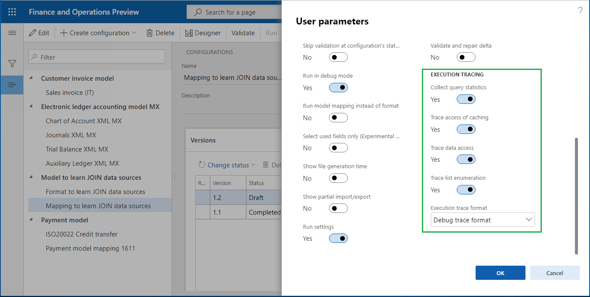
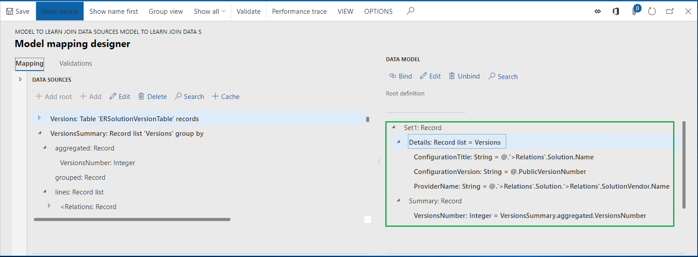
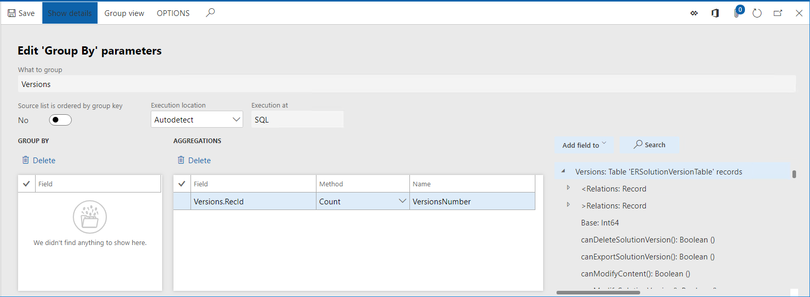
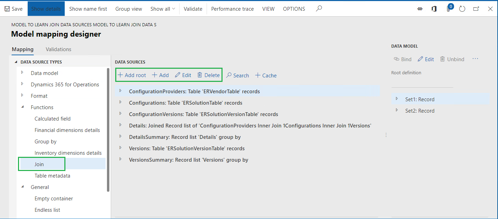
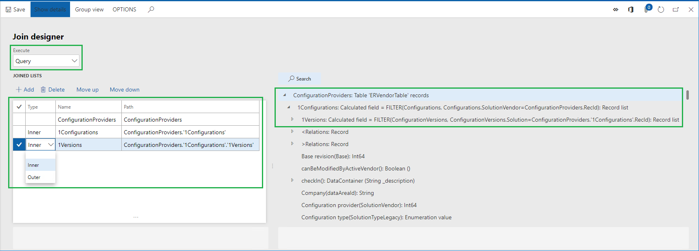
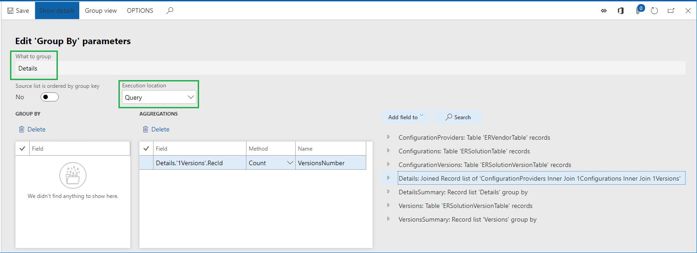
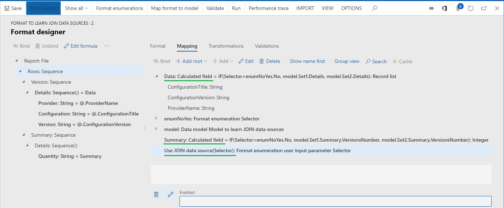
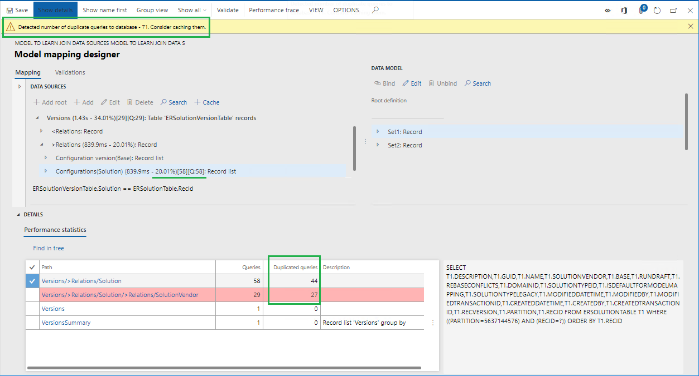

# Verwenden Sie JOIN-Datenquellen in ER-Modellzuordnungen, um Daten aus mehreren Anwendungstabellen abzurufen

[!include[banner](../includes/banner.md)]

Beim Konfigurieren von ER-Modellzuordnungen oder -formaten können Sie erforderliche Datenquellen vom Typ **Join** [hinzufügen](#review). Zur Entwurfszeit wird eine **Join**-Datenquelle als Satz mehrerer Datenquellen konfiguriert, von denen jede eine Liste der Datensätze zurückgibt. Für jede Datenquelle mit Ausnahme der ersten müssen die erforderlichen Bedingungen definiert werden, um Datensätze der aktuellen und früheren Datenquellen zu verknüpfen. Zur Laufzeit gibt eine konfigurierte Datenquelle vom Typ **Join** eine einzelne verknüpfte Liste von Datensätzen mit Feldern von Datensätzen von geschachtelten Datenquellen [zurück](#executeERformat).

Die folgenden Join-Typen werden derzeit unterstützt:

- (Linker) Außen-Join:
    - Join aller Datensätze der ersten (am weitesten links stehenden) Datenquelle und dann alle passenden in Übereinstimmung mit konfigurierten Bedingungsdatensätzen der zweiten (äußersten rechten) Datenquelle.
- (Rechter) Innen-Join:
    - Join nur von Datensätzen der ersten (am weitesten links stehenden) Datenquelle und nur von Datensätzen der zweiten (äußersten rechten) Datenquelle, die zueinander passen und in Übereinstimmung mit konfigurierten Bedingungen.

In der konfigurierten **Join**-Datenquelle, wenn alle Datenquellen vom Typ **Table records** sind, kann die Ausführung der Join-Datenquelle über eine einzelne SQL-Anweisung [auf Datenbankebene durchgeführt](#analyze) werden. Diese Anweisung verringert die Anzahl von Datenbankaufrufen, was die Modellzuordnungsleistung verbessert. Andernfalls erfolgt die Ausführung der **Join data**-Quelle nur im Arbeitsspeicher.

> [!NOTE]
> Die Verwendung der Funktion **VALUEIN** in ER-Ausdrücken, die Bedingungen zum Verknüpfen von Datensätzen in Datenquellen vom Join-Typ angeben, wird noch nicht unterstützt. Besuchen Sie die Seite [Formeldesigner in der elektronischen Berichterstellung](general-electronic-reporting-formula-designer.md) für weitere Details zu dieser Funktion.

Weitere Informationen über diese Funktion erhalten Sie, wenn Sie das Beispiel in diesem Thema abschließen.

## Beispiel: Verwendung von JOIN-Datenquellen in ER-Modellzuordnungen

In den folgenden Schritten wird erklärt, wie der Systemadministrator oder der ER-Entwickler eine ER-Modellzuordnung konfigurieren kann, um Daten aus mehreren Anwendungstabellen gleichzeitig abzurufen, indem Datenquellen des Typs **Join** verwendet werden, um die Datenzugriffsleistung zu verbessern. Diese Schritte können für beliebige Unternehmen von Dynamics 365 Finance oder in den Regulatory Configuration Services (RCS) ausgeführt werden.

### Voraussetzungen

Um die Beispiele in diesem Thema durchzuführen, müssen Sie Zugriff auf eines der Folgenden haben, abhängig von dem Dienst, der verwendet wird, um diese Schritte durchzuführen:

**Zugriff auf Finance für eine der folgenden Rollen:**

- Entwickler für elektronische Berichterstellung
- Funktionaler Berater für elektronische Berichterstellung
- Systemadministrator

**Zugriff auf RCS für eine der folgenden Rollen:**

- Entwickler für elektronische Berichterstellung
- Funktionaler Berater für elektronische Berichterstellung
- Systemadministrator

Sie müssen außerdem zunächst die Schritte unter der Prozedur [Konfigurationsanbieter erstellen und als aktiv markieren](tasks/er-configuration-provider-mark-it-active-2016-11.md) durchführen.

Vorab müssen Sie auch die folgenden ER-Beispiel-Konfigurationsdateien vom [Microsoft Download Center](https://go.microsoft.com/fwlink/?linkid=000000) herunterladen und lokal speichern:

| **Inhaltsbeschreibung**  | **Dateiname**   |
|--------------------------|-----------------|
| **ER-Datenmodell**-Beispielkonfigurationsdatei, die als Datenquelle für die Beispiele verwendet wird.| [Model to learn JOIN data sources.version.1.1.xml](https://mbs.microsoft.com/customersource/Global/AX/downloads/hot-fixes/365optelecrepeg) |
| **ER-Datenmodellzuordnung**-Beispielkonfigurationsdatei, die das ER-Datenmodell für die Beispiele implementiert. | [Mapping to learn JOIN data sources.version.1.1.xml](https://mbs.microsoft.com/customersource/Global/AX/downloads/hot-fixes/365optelecrepeg) |
| **ER-Format**-Beispielkonfigurationsdatei. Diese Datei beschreibt die Daten zum Auffüllen der ER-Formatkomponente für die Beispiele. | [Format to learn JOIN data sources.version.1.1.xml](https://mbs.microsoft.com/customersource/Global/AX/downloads/hot-fixes/365optelecrepeg) |

### Aktivieren eines Konfigurationsanbieters

1. Greifen Sie entweder auf Finance oder RCS in der ersten Sitzung des Webbrowsers zu.
2. Wechseln Sie zu **Organisationsverwaltung  \>Arbeitsbereiche \>  Elektronische Berichterstellung**.
3. Überprüfen Sie auf der Seite **Lokalisierungskonfigurationen** im Abschnitt **Konfigurationsanbieter**, ob der Konfigurationsanbieter für das Beispielunternehmen [Litware, Inc.](http://www.litware.com) aufgeführt und als **Aktiv** markiert ist. Wenn Sie diesen Konfigurationsanbieter nicht sehen, müssen Sie zunächst die Schritte in der Prozedur [Konfigurationsanbieter erstellen und als aktiv markieren](tasks/er-configuration-provider-mark-it-active-2016-11.md) befolgen.

    

### ER-Beispielkonfigurationsdateien importieren

1. Wählen Sie **Berichterstellungskonfigurationen** aus.
2. Importieren Sie die ER-Datenmodellkonfigurationsdatei.
    1. Wählen Sie **Wechselkurs** aus.
    2. Wählen Sie **Aus XML-Datei laden** aus.
    3. Wählen Sie **Durchsuchen** aus, um die **Model to learn JOIN data sources.version.1.1.xml**-Datei zu suchen.
    4. Wählen Sie **OK**.
3. Importieren Sie die Konfigurationsdatei für die EB-Modellzuordnung.
    1. Wählen Sie **Wechselkurs** aus.
    2. Wählen Sie **Aus XML-Datei laden** aus.
    3. Wählen Sie **Durchsuchen** aus, um die **Mapping to learn JOIN data sources.version.1.1.xml**-Datei zu suchen.
    4. Wählen Sie **OK**.
4. Importieren Sie die ER-Formatkonfigurationsdatei.
    1. Wählen Sie **Wechselkurs** aus.
    2. Wählen Sie **Aus XML-Datei laden** aus.
    3. Wählen Sie **Durchsuchen** aus, um die **Format to learn JOIN data sources.version.1.1.xml**-Datei zu suchen.
    4. Wählen Sie **OK**.
5. In der Konfigurationsstruktur erweitern Sie das Element **Model to learn JOIN data sources** sowie weitere Modellelemente (falls verfügbar).
6. Achten Sie auf die Liste der ER-Konfigurationen in der Baumstruktur sowie die Versionsdetails auf der **Versionen**-Schnellregisterkarte – sie werden als Quelle der Daten für den Beispielbericht verwendet.

    

### Aktivieren der Ausführungsablaufverfolgungsoptionen

1. Wählen Sie **KONFIGURATIONEN** aus.
2. Wählen Sie **Benutzerparameter** aus.
3. Legen Sie die Ausführungsablaufverfolgungsparameter wie im Screenshot unten fest.

    

    Wenn diese Parameter aktiviert sind, wird für jede Ausführung der importierten ER-Formatdatei die Ausführungsablaufverfolgung generiert. Mithilfe der Details der generierten Ausführungsnachverfolgung können Sie die Ausführung der EB-Format- und EB-Modellzuordnungskomponenten analysieren. Besuchen Sie die [Ausführung des EB-Formats nachverfolgen, um Leistungsprobleme zu behandeln](trace-execution-er-troubleshoot-perf.md)-Seite für weitere Informationen zur ER-Ausführungsablaufverfolgungsfunktion.

### Überprüfen der ER-Modellzuordnung (Teil 1)

Überprüfen Sie die Einstellungen der EB-Modellzuordnungskomponente. Die Komponente wird konfiguriert, um auf Informationen zu Versionen von ER-Konfigurationen, Details von Konfigurationen und Konfigurationsanbieter zuzugreifen, ohne Datenquellen des Typs **Join** zu verwenden.

1. Wählen Sie die Konfiguration **Mapping to learn JOIN data sources** aus.
2. Wählen Sie **Designer** aus, um die Liste der Zuordnungen zu öffnen.
3. Wählen Sie **Designer** aus, um die Zuordnungsdetails zu prüfen.
4. Wählen Sie **Details anzeigen**.
5. In der Konfigurationsstruktur erweitern Sie die **Set1**- und **Set1.Details**-Datenmodellelemente:

    1. Die Bindung **Details: Record list = Versions** gibt an, dass das **Set1.Details**-Element an die Datenquelle **Versionen** gebunden ist, die Datensätze der Tabelle **ERSolutionVersionTable** zurückgibt. Jeder Datensatz dieser Tabelle stellt eine einzelne Version einer ER-Konfiguration dar. Der Inhalt dieser Tabelle wird in der **Versionen**-Schnellregisterkarte auf der Seite **Varianten** angezeigt.
    2. Die Bindung **ConfigurationVersion: String = @.PublicVersionNumber** bedeutet, dass der Wert der öffentlichen Version der jeweiligen ER-Konfigurationsversion aus dem Feld **PublicVersionNumber** der **ERSolutionVersionTable**-Tabelle übernommen und dem **ConfigurationVersion**-Element hinzugefügt wird.
    3. Die Bindung **ConfigurationTitle: String = @.'>Relations'.Solution.Name** gibt an, dass der Name einer ER-Konfiguration aus dem Feld **Name** der **ERSolutionTable**-Tabelle übernommen wird, durch Bewertung über die Viele-zu-Eins-Beziehung (**'>Relations'**) zwischen den Tabellen **ERSolutionVersionTable** und **ERSolutionTable**. Die Namen von ER-Konfigurationen der aktuellen Anwendungsinstanz werden in der Konfigurationsstruktur auf der Seite **Varianten** angezeigt.
    4. Die Bindung **@.'>Relations'.Solution.'>Relations'.SolutionVendor.Name** bedeutet, dass der Name des Konfigurationsanbieters, der die aktuelle Konfiguration besitzt, aus dem Feld **Name** der Tabelle **ERVendorTable** übernommen wird, durch Bewertung über die Viele-zu-Eins-Beziehung zwischen den Tabellen **ERSolutionTable** und **ERVendorTable**. Die Namen von ER-Konfigurationsanbietern werden in der Konfigurationsstruktur auf der Seite **Varianten** der Seitenkopfzeile für die jeweilige Konfiguration angezeigt. Die gesamte Liste der ER-Konfigurationsanbieter kann auf der **Organisationsverwaltung \> Elektronische Berichterstellung \> Konfigurationsanbieter**-Tabellenseite gefunden werden.

    

6. In der Konfigurationsstruktur erweitern Sie das **Set1.Summary**-Datenmodellelement:

    1. Die Bindung **VersionsNumber: Integer = VersionsSummary.aggregated.VersionsNumber** gibt an, dass das **Set1.Summary.VersionsNumber**-Element an das **VersionsNumber**-Aggregationsfeld der **VersionsSummary**-Datenquelle des **GroupBy**-Typs gebunden ist, der konfiguriert wurde, um die Anzahl der Datensätze der **ERSolutionVersionTable**-Tabelle über die **Versionen**-Datenquelle zurückzugeben.

    

7. Schließen Sie die Seite.

###  Überprüfen der ER-Modellzuordnung (Teil 2)

Überprüfen Sie die Einstellungen der EB-Modellzuordnungskomponente. Die Komponente wird konfiguriert, um auf Informationen zu Versionen von ER-Konfigurationen, Details von Konfigurationen und Konfigurationsanbieter zuzugreifen, unter Verwendung einer Datenquelle des Typs **Join**.

1. In der Konfigurationsstruktur erweitern Sie die **Set2**- und **Set2.Details**-Datenmodellelemente. Die Bindung **Details: Record list = Details** gibt an, dass das Element **Set2.Details** an die **Details**-Datenquelle gebunden ist, die als Datenquelle des Typs **Join** konfiguriert ist.

    

    Die **Join**-Datenquelle kann hinzugefügt werden, indem die Datenquelle **Functions\Join** ausgewählt wird:

    

2. Wählen Sie die **Details**-Datenquelle aus.
3. Wählen Sie **Bearbeiten** im Bereich **Datenquellen** aus.
4. Wählen Sie **Join bearbeiten** aus.
5. Wählen Sie **Details anzeigen**.

    

    Diese Seite wird verwendet, um die erforderliche Datenquelle des **Join**-Typs zu entwerfen. Zur Laufzeit erstellt diese Datenquelle eine einzelne verknüpfte Liste von Datensätzen der Datenquellen im Raster **Verknüpfte Liste**. Die Verknüpfung von Datensätzen startet aus der Datenquelle **ConfigurationProviders**, die im Raster als Erstes vorhanden ist (die **Typ**-Spalte ist dafür leer). Die Datensätze jeder anderen Datenquelle werden anschließend mit Datensätzen der übergeordneten Datenquelle basierend auf deren Reihenfolge in diesem Raster verknüpft. Jede verknüpfende Datenquelle muss als Datenquelle konfiguriert werden, die unter einer Zieldatenquelle geschachtelt wird (die `1Versions`-Datenquelle wird unter `1Configurations` geschachtelt; die `1Configurations`-Datenquelle wird unter **ConfigurationProviders** geschachtelt). Jede konfigurierte Datenquelle muss die Bedingungen für die Verknüpfung enthalten. In der Datenquelle für diesen bestimmte **Verknüpfung** werden die folgenden Verknüpfungen definiert:

    - Jeder Datensatz der Datenquelle **ConfigurationProviders** (bezogen auf die Tabelle **ERVendorTable**) wird nur mit Datensätzen der **1Configurations**-Datenquelle (auf die in der **ERSolutionTable**-Tabelle verwiesen wird) mit dem gleichen Wert in den Feldern **SolutionVendor** und **RecId** verknüpft. Der Typ **Innen-Join** wird für diese Verknüpfung verwendet, wie auch die folgenden Bedingungen für übereinstimmende Datensätze:

    FILTER (Configurations, Configurations.SolutionVendor = ConfigurationProviders.RecId)

    - Jeder Datensatz der Datenquelle **1Configurations** (bezogen auf die Tabelle **ERSolutionTable**) wird nur mit Datensätzen der **1Versions**-Datenquelle (bezogen auf die **ERSolutionVersionTable**-Tabelle) mit dem gleichen Wert in den Feldern **Solution** und **RecId** verknüpft. Der Typ **Innen-Join** wird für diese Verknüpfung verwendet, wie auch die folgenden Bedingungen für übereinstimmende Datensätze:

    FILTER (ConfigurationVersions, ConfigurationVersions.Solution = ConfigurationProviders.'1Configurations'.RecId)

    - Die **Ausführen**-Option wird als **Abfrage** konfiguriert, was bedeutet, dass diese Verknüpfungsdatenquelle zur Laufzeit auf Datenbankebene als direkter SQL-Aufruf ausgeführt wird.

    Zum Verknüpfen von Datensätzen der Datenquellen, die Anwendungstabellen darstellen, können Sie Verknüpfungsbedingungen angeben, indem Sie Paare von Feldern verwenden, die nicht denen entsprechen, die vorhandene in AOT-Relationen zwischen diesen Tabellen beschreiben. Dieser Typ der Verknüpfung kann so konfiguriert werden, dass er auch auf Datenbankebene ausgeführt wird.

6. Schließen Sie die Seite.
7. Wählen Sie **Abbrechen** aus.
8. In der Konfigurationsstruktur erweitern Sie das **Set2.Summary**-Datenmodellelement:

    - Die Bindung **VersionsNumber: Integer = DetailsSummary.aggregated.VersionsNumber** gibt an, dass das **Set2.Summary.VersionsNumber**-Element an das **VersionsNumber**-Aggregationsfeld der **DetailsSummary**-Datenquelle des **GroupBy**-Typs gebunden ist, der konfiguriert wurde, um die Anzahl der verknüpften Datensätze der **Details**-Datenquelle des **Join**-Typs zurückzugeben.
    - Die **Ausführen**-Standortoption ist als **Abfrage** konfiguriert, was bedeutet, dass diese **GroupBy**-Datenquelle zur Laufzeit als direkter SQL-Aufruf auf Datenbankebene ausgeführt wird. Dieses Verhalten ist möglich, da die Basisdatenquelle **Details** des Typs **Join** so konfiguriert ist, dass sie auf der Datenbankebene ausgeführt wird.

    

9. Schließen Sie die Seite.
10. Wählen Sie **Abbrechen** aus.

###  ER-Format ausführen

1. Rufen Sie Finance oder RCS in der zweiten Sitzung des Webbrowsers mit den gleichen Anmeldeinformationen und dem gleichen Unternehmen wie in der ersten Sitzung auf.
2. Wechseln Sie zu **Organisationsverwaltung \> Elektronische Berichterstellung \> Konfigurationen**.
3. Erweitern Sie die Konfiguration **Model to learn JOIN data sources** aus.
4. Wählen Sie die Konfiguration **Format to learn JOIN data sources** aus.
5. Wählen Sie **Designer** aus.
6. Wählen Sie **Details anzeigen**.
7. Wählen Sie **Zuordnung** aus.
8. Wählen Sie **Erweitern/Reduzieren** aus.

    Dieses Format wurde entwickelt, um eine generierte Textdatei mit einer neuen Position für jede Version einer EB-Konfiguration (**Version**-Nummernkreis) aufzufüllen. Jede generierte Position enthält den Namen eines Konfigurationsanbieters, der die aktuelle Konfiguration besitzt, den Namen der Konfiguration und die Version der Konfiguration, die von einem Semikolon getrennt wird. Die abschließende Position der generierten Datei enthält die Anzahl der erkannten Versionen von ER-Konfigurationen (**Zusammenfassung**-Nummernkreis).

    

    Die **Daten**- und **Zusammenfassung**-Datenquellen werden verwendet, um Konfigurationsversionsdetails für die generierte Datei aufzufüllen:

    - Die Informationen im **Set1**-Datenmodell werden verwendet, wenn Sie **Nein** für die Datenquelle **Auswahl** zur Laufzeit auf der Benutzerdialogfeldseite beim Ausführen des ER-Formats auswählen.
    - Die Informationen im **Set2**-Datenmodell werden verwendet, wenn Sie **Ja** für die Datenquelle **Auswahl** zur Laufzeit auf der Benutzerdialogfeldseite auswählen.

    

9. Wählen Sie **Ausführen** aus.
10. Wählen Sie auf der Dialogfeldseite **Nein** im Feld **JOIN-Datenquelle verwenden** aus.
11. Wählen Sie **OK**.
12. Überprüfen Sie die generierte Datei.

    

#### Analysieren der ER-Formatausführungsablaufverfolgung

1. In der ersten Sitzung von Finance oder RCS wählen Sie **Designer** aus.
2. Wählen Sie **Leistungsnachverfolgung** aus.
3. Wählen Sie im Raster **Leistungsnachverfolgung** den obersten Datensatz der letzten Ausführungsablaufverfolgung eines ER-Formats aus, das die aktuelle Modellzuordnungskomponente verwendet hat.
4. Wählen Sie **OK**.

    Die Ausführungsstatistiken informieren Sie über duplizierte Aufrufe der Anwendungstabellen:

    - **ERSolutionTable** wurde so oft aufgerufen wie Konfigurationsversionsdatensätze in der Tabelle **ERSolutionVersionTable** vorhanden sind, während die Anzahl solcher Aufrufe zur Leistungsverbesserung verringert werden konnte.
    - **ERVendorTable** wurde zweimal aufgerufen für jeden Konfigurationsversionsdatensatz, der in der Tabelle **ERSolutionVersionTable** ermittelt wurde, während die Anzahl solcher Aufrufe ebenfalls verringert werden konnte.

    

5. Schließen Sie die Seite.

### ER-Format ausführen

1. Wechseln Sie zu der Webbrowserregisterkarte mit der zweiten der Sitzung von Finance oder RCS.
2. Wählen Sie **Ausführen** aus.
3. Wählen Sie auf der Dialogfeldseite **Ja** im Feld **JOIN-Datenquelle verwenden** aus.
4. Wählen Sie **OK**.
5. Überprüfen Sie die generierte Datei.

    

####  Analysieren der ER-Formatausführungsablaufverfolgung

1. In der ersten Sitzung von Finance oder RCS wählen Sie **Designer** aus.
2. Wählen Sie **Leistungsnachverfolgung** aus.
3. Wählen Sie im Raster **Leistungsnachverfolgung** den obersten Datensatz der letzten Ausführungsablaufverfolgung eines ER-Formats aus, das die aktuelle Modellzuordnungskomponente verwendet hat.
4. Wählen Sie **OK**.

    Die Statistik informiert Sie über Folgendes:

    - Die Anwendungsdatenbank wurde einmal aufgerufen, um Datensätze von **ERVendorTable**, **ERSolutionTable** und **ERSolutionVersionTable** abzurufen, um auf Pflichtfelder zuzugreifen.

    

    - Die Anwendungsdatenbank wurde einmal aufgerufen, um die Anzahl von Konfigurationsversionen zu berechnen, indem Verknüpfungen verwendet wurden, die in der **Details**-Datenquelle konfiguriert wurden.

    

## Einschränkungen

Wie Sie dem Beispiel in diesem Thema entnehmen können, kann die Datenquelle **VERKNÜPFEN** aus mehreren Datenquellen erstellt werden, die die einzelnen Datasets der Datensätze beschreiben, die schließlich verknüpft werden müssen. Sie können diese Datenquellen mithilfe der integrierten EB-[FILTER](er-functions-list-filter.md)-Funktion konfigurieren. Wenn Sie die Datenquelle so konfigurieren, dass sie über die Datenquelle **VERKNÜPFEN** hinaus aufgerufen wird, können Sie die Unternehmensbereiche als Teil der Bedingung für die Datenauswahl verwenden. Die anfängliche Umsetzung der **VERKNÜPFEN**-Datenquelle unterstützt keine Datenquellen dieses Typs. Zum Beispiel, wenn Sie eine [FILTER](er-functions-list-filter.md)-basierte Datenquelle im Rahmen der Ausführung einer **VERKNÜPFEN**-Datenquelle aufrufen, wenn die aufgerufene Datenquelle Unternehmensbereiche enthält als Teil der Bedingung für die Datenauswahl, tritt eine Ausnahme auf.

In Microsoft Dynamics 365 Finance Version 10.0.12 (August 2020) können Sie Unternehmensbereiche als Teil der Bedingung für die Datenauswahl in [FILTER](er-functions-list-filter.md)-basierten Datenquellen verwenden, die im Rahmen der Ausführung einer **VERKNÜPFEN**-Datenquelle aufgerufen werden. Wegen der Einschränkungen der Anwendung [Abfrage (This is an external link)](https://docs.microsoft.com/de-de/dynamics365/supply-chain/fin-ops-core/dev-itpro/dev-ref/xpp-library-objects)-Generator werden die Unternehmensbereiche nur für die erste Datenquelle einer **VERKNÜPFEN**-Datenquelle unterstützt.

### Beispiel

Beispielsweise müssen Sie die Anwendungsdatenbank einmal aufrufen, um die Liste der Außenhandelstransaktionen mehrerer Unternehmen und die Details des Lagerartikels abzurufen, auf den in diesen Transaktionen Bezug genommen wird.

In diesem Fall konfigurieren Sie die folgenden Artefakte in Ihrer EB-Modellzuordnung:

- **Intrastat**-Stammdatenquelle, die die **Intrastat**-Tabelle darstellt.
- **Elemente**-Stammdatenquelle, die die **InventTable**-Tabelle darstellt.
- **Unternehmen**-Stammdatenquelle, die die Liste der Unternehmen zurückgibt (**DEMF** und **GBSI** in diesem Beispiel), wo auf Transaktionen zugegriffen werden muss. Der Unternehmenscode ist verfügbar aus dem Feld **Companies.Code**.
- **X1**-Stammdatenquelle mit dem Ausdruck `FILTER (Intrastat, VALUEIN(Intrastat.dataAreaId, Companies, Companies.Code))`. Als Teil der Bedingung für die Datenauswahl enthält dieser Ausdruck die Definition von Unternehmensbereichen `VALUEIN(Intrastat.dataAreaId, Companies, Companies.Code)`.
- **X2**-Datenquelle als verschachteltes Element der **X1**-Datenquelle. Es enthält den Ausdruck `FILTER (Items, Items.ItemId = X1.ItemId)`.

Schließlich können Sie eine **VERKNÜPFEN**-Datenquelle konfigurieren, bei der **X1** die erste Datenquelle und **X2** die zweite Datenquelle ist. Sie können **Abfrage** als **Ausführen**-Option angeben, um zu erzwingen, dass EB diese Datenquelle auf Datenbankebene als direkten SQL-Aufruf ausführt.

Wenn die konfigurierte Datenquelle ausgeführt wird, während die EB-Ausführung [nachverfolgt](trace-execution-er-troubleshoot-perf.md) wird, wird die folgende Anweisung im EB-Modellzuordnungs-Designer als Teil der EB-Leistungsnachverfolgung angezeigt.

`SELECT ... FROM INTRASTAT T1 CROSS JOIN INVENTTABLE T2 WHERE ((T1.PARTITION=?) AND (T1.DATAAREAID IN (N'DEMF',N'GBSI') )) AND ((T2.PARTITION=?) AND (T2.ITEMID=T1.ITEMID AND (T2.DATAAREAID = T1.DATAAREAID) AND (T2.PARTITION = T1.PARTITION))) ORDER BY T1.DISPATCHID,T1.SEQNUM`

> [!NOTE]
> Ein Fehler tritt auf, wenn Sie eine **VERKNÜPFEN**-Datenquelle ausführen, die so konfiguriert wurde, dass sie Datenauswahlbedingungen enthält, die Unternehmensbereiche für zusätzliche Datenquellen der ausgeführten **VERKNÜPFEN**-Datenquelle haben.

## Zusätzliche Ressourcen

[Formeldesigner in der elektronischen Berichterstellung](general-electronic-reporting-formula-designer.md)

[Ausführung des EB-Formats nachverfolgen, um Leistungsprobleme zu behandeln](trace-execution-er-troubleshoot-perf.md)
