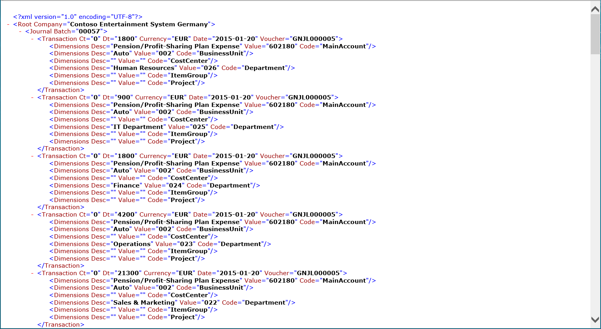

# ER – Verwendung von Finanzdimensionen als Datenquelle (Teil 4: Berichtsausführung)

[!include [banner](../../includes/banner.md)]

In den folgenden Schritten wird erläutert, wie ein Benutzer mit der Rolle Systemadministrator oder Entwickler für elektronische Berichterstellung ein ER-Modell zur Nutzung von Finanzdimensionen als Datenquelle für ER-Berichte nutzen kann. Diese Schritte können im DEMF-Unternehmen ausgeführt werden.

Um diese Schritte auszuführen, müssen Sie erst die Schritte im Verfahren „ER - Finanzdimensionen als Datenquelle nutzen (Teil 3: Design des Berichts)“ ausführen. Sie müssen außerdem Standarddokumenttypen der elektronischen Berichterstellungsparameterseite konfigurieren. Standarddokumenttypen werden auch festgelegt, wenn Sie alle ER-Konfiguration herunterladen und importieren. 

## Berichte ausführen
1. Wechseln Sie zu Organisationsverwaltung > Elektronische Berichterstellung > Konfigurationen.
2. Erweitern Sie in der Struktur "Finanzdimensions-Beispielmodell".
3. Wählen Sie in der Struktur "Finanzdimensions-Beispielmodell\Sachkontoerfassungsbericht".
4. Klicken Sie auf Ausführen.

5. Geben Sie im Feld 'Dimensionsname' einen Wert ein, oder wählen Sie einen Wert aus.
    * Um alle Dimensionen im aktuellen Unternehmen auszuwählen, geben Sie folgende Informationen ein: BusinessUnit;CostCenter;Department;ItemGroup;MainAccount;Project  

6. Erweitern Sie den Abschnitt "Einzuschließende Datensätze".
7. Klicken Sie auf "Filter".
8. Wählen Sie die Zeile für die Sachkontoerfassungstabelle und das Feld Erfassungschargennummer aus.
9. Geben Sie im Feld "Kriterien" den Wert "00057" ein.
10. Klicken Sie auf "OK".
11. Klicken Sie auf "OK".

    * Prüfen Sie das generierte Ergebnis. Für jede Buchung der ausgewählten Charge werden die Finanzdimensionen aus den entsprechenden Dimensionssatz dargestellt. Führen Sie diesen Bericht aus und wählen Sie unterschiedliche Dimensionen aus, um zu sehen, dass der Bericht nicht von der Anzahl der ausgewählten Dimensionen oder aus der Anzahl der Dimensionen abhängt, die für diese Instanz konfiguriert werden.  

