# Budgetplanung

[!include [banner](../includes/banner.md)]

Das Ziel dieser Übungseinheit ist es, eine Übersicht über aktualisierte Funktionen in Microsoft Dynamics 365 Finance im Budgetplanbereich bereitzustellen. Ziel dieser Übungseinheit ist es, ein schnelles Konfigurationsbeispiel für das Budgetplanungsmodul zu illustrieren und zu zeigen, wie die Budgetplanung mithilfe dieser Konfiguration erstellt werden kann.  Diese Übungseinheit konzentriert sich auf die folgenden Geschäftsprozesse oder Aufgaben:
- Erstellen Sie die Organisationshierarchie aus, die für den Budgetplanungsprozess verwendet werden soll.
- Budgetplanszenario, Budgetplan-Spalte, Layout und Excel-Vorlage definieren
- Erstellender und aktivieren der Budgetplanungsprozesse
- Erstellen des Budgetplandokuments durch Übernehmen der aktuellen Zahlen aus dem Hauptbuch
- Verwenden der Zuweisungen, um die Budgetplandokumentdaten anzupassen
- Budgetplan-Dokumentdaten in Excel bearbeiten 

Voraussetzungen 
------------------

Für dieses Lernprogramm müssen Sie auf die Microsoft Dynamics 365 Finance-Umgebung mit Contoso-Demodaten zugreifen und werden als Administrator auf der Instanz bereitgestellt. Verwenden Sie für diese Übungseinheit nicht den privaten Browsermodus - melden Sie sich falls erforderlich von einem anderen Konto ab und mit den Administrator-Anmeldeinformationen wieder an. Wenn Sie sich anmelden, **MÜSSEN** Sie das Kontrollkästchen „Angemeldet bleiben“ aktivieren. Dadurch wird ein persistentes Cookie erstellt, das die Excel-App derzeit benötigt. Wenn Sie sich bei der Anwendung nicht mithilfe eines IE-Browsers anmelden, werden Sie aufgefordert, sich mit der Excel-App anzumelden. Beim Sie auf "Anmelden" in der Excel-App klicken, wird im IE ein Popup- Fenster geöffnet und Sie **MÜSSEN** das Kontrollkästchen „Angemeldet bleiben“ aktivieren. Wenn Sie in der Excel-App auf "Anmelden" klicken, und nichts passiert, leeren Sie den Cookie-Zwischenspeicher des IE.

## **Szenarioüberblick**
Julia arbeitet als Finanzmanager in Contoso Entertainment Systems in Deutschland (DEMF). Mit dem sich nähernden GJ 2016 muss sie an der Einrichtung des Unternehmensbudgets für das kommende jahr arbeiten. Budgetvorbereitung sieht wie folgt aus:

1.  Julia verwendet Istwerte des Vorjahres als Ausgangspunkt, um das Budget zu erstellen.
2.  Auf Grundlage der Istwerte des Vorjahres erstellt sie Vorkalkulationen für 12 Monate im kommenden Jahr
3.  Julia überprüft das Budget mit dem Leiter der Finanzabteilung. Sobald sie fertig ist, nimmt sie die erforderlichen Regulierungen für den Budgetplan vor und schließt die Budgetausarbeitung ab.

Das Budgetplanungs-Konfigurationsschema für das Szenario sieht wie folgt aus:

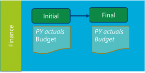

Julia wird folgende Excel Tabelle erstellen, um das Budget vorzubereiten:

[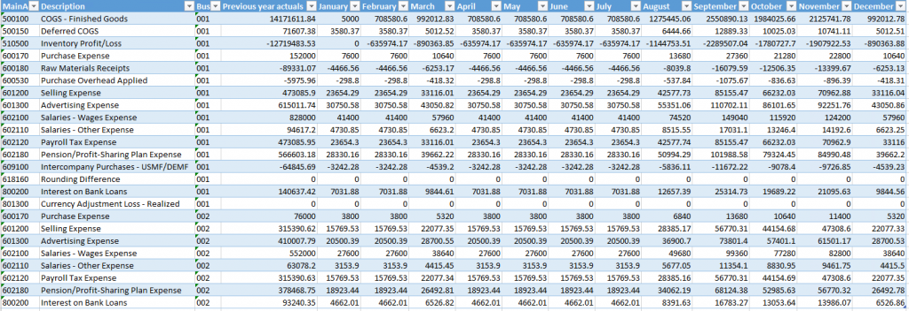](./media/screenshot2.png)

## Übung 1: Konfiguration

### **Aufgabe 1: Organisationshierarchie erstellen**
Da der ganze Budgetierungsprozess in der Finanzabteilung geschieht, muss Julia eine sehr einfache Organisationshierarchie erstellen, die nur aus der Finanzabteilung besteht. 

1.1. Navigieren Sie zu den Organisationshierarchien (Organisationsverwaltung &gt; Organisationen &gt; Organisationshierarchien), und klicken Sie auf die Schaltfläche „Neu“.

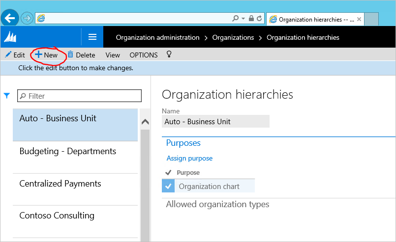 

1.2. Geben Sie den Namen für die Organisationshierarchie ein das Feld „Name“ ein, und klicken Sie auf die Schaltfläche „Zweck zuweisen“.

1.3. Wählen Sie den Budgetplanungszweck aus, klicken Sie auf „Hinzufügen“, und weisen Sie die neu erstellte Organisationshierarchie zu. 

[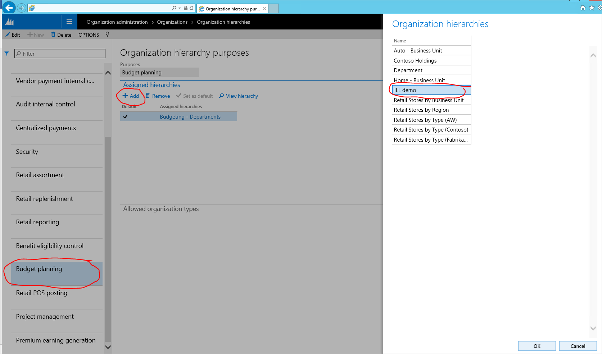](./media/screenshot5.png)

1.4. Wiederholen Sie den obigen Schritt für den Zweck der Organisationssicherheit. Schließen Sie das Formular, wenn Sie fertig sind.

1.5. Klicken Sie im Formular „Organisationshierarchie“ auf die Schaltfläche „Ansicht“. Klicken Sie im Hierarchie-Designer auf „Bearbeiten“, und erstellen Sie eine Hierarchie, indem Sie auf „Einfügen“ klicken.

[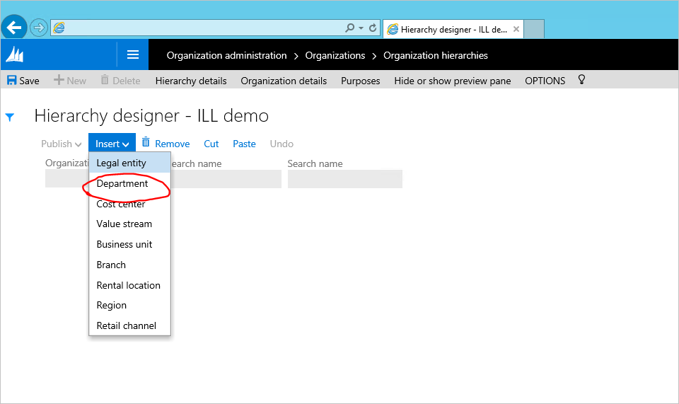](./media/screenshot7.png) 

1.6. Wählen Sie die Finanzabteilung für die Budgethierarchie aus. 

1.7. Wenn Sie fertig sind, klicken Sie auf „Veröffentlichen“ und „Schließen“. Wählen Sie 01.01.2015 als Gültigkeitsdatum für die Hierarchieveröffentlichung aus.

[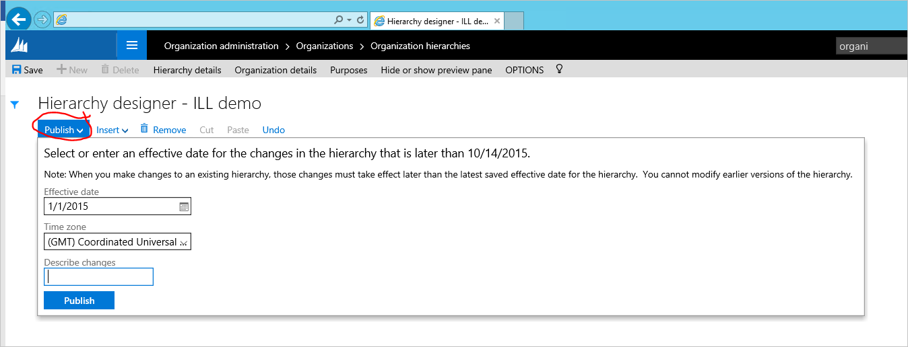](./media/screenshot9.png)

### Aufgabe 2: Benutzersicherheit konfigurieren
Budgetplanung verwendet spezielle Sicherheitsrichtlinien, um den Zugriff auf die Budgetpläne zu konfigurieren. Julia muss den Zugriff auf die Finanzbudgetpläne selbst erteilen. 

2.1. Wechsel zum DEMF-Kontext für die juristische Entität. 

2.2. Navigieren Sie zu Budgetierung &gt; Einrichtung &gt; Budgetplanung&gt; Budgetplanungskonfiguration. Legen Sie auf der Registerkarte „Parameter“ den Sicherheitsmodellwert auf „Basierend auf Sicherheitsorganisationen“ fest. 

 

2.3. Navigieren Sie zu Systemverwaltung &gt; Benutzer &gt; Benutzer. Geben Sie dem Benutzer Admin (Julia Funderburk) die Budget-Manager-Rolle. 

[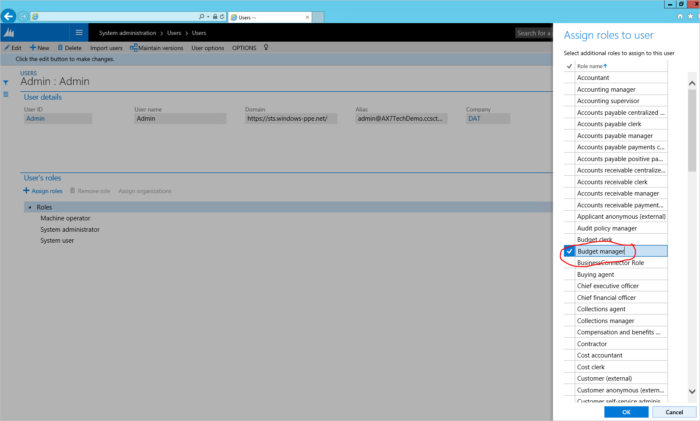](./media/screenshot12.png) 

2.4. Wählen Sie die Benutzerrolle aus, und klicken Sie auf „Organisationen zuweisen“. 

[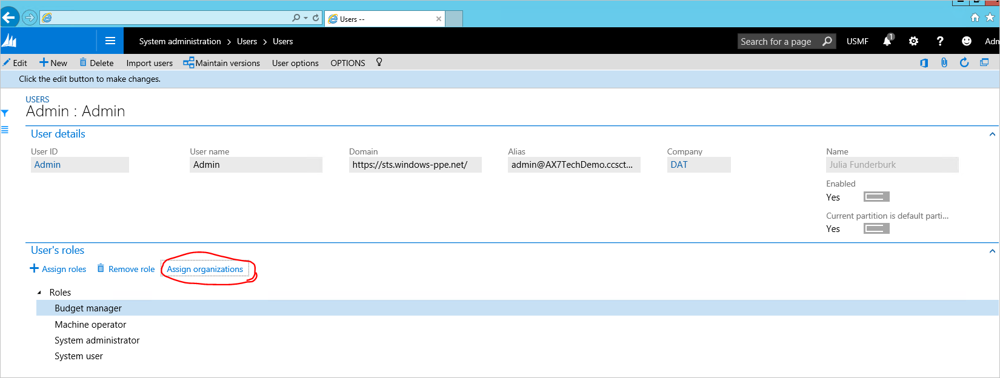](./media/screenshot13.png)

2.5. Wählen Sie "Zugriff individuell auf spezifische Organisationen erteilen" aus. Wählen Sie die im ersten Schritt erstellte Organisationshierarchie aus. Wählen Sie „Finanzknoten“ aus, und klicken Sie auf die Schaltfläche „Zugriff erteilen (inkl. untergeordnete Elemente)“. 

***Wichtig!*** *Stellen Sie sicher, dass Sie sich im Kontext DEMF Juristische Person befinden, wenn Sie diese Aufgabe ausführen, da die Organisationssicherheit pro juristische Person angewendet wird.* 

### Abgabe 3: Szenarien erstellen
3.1. Navigieren Sie zu Budgetierung &gt; Einrichtung &gt; Budgetplanung&gt; Budgetplanung konfigurieren. Beachten Sie auf der Szenarioseite die Szenarien, die wir später in dieser Übungseinheit verwenden werden: Vorjahres-Istwerte und Budgetiert. 

*Hinweis: Sie können neue Szenarien für diese Übung erstellen, wenn sie wünschen, und stattdessen diese verwenden.* 

[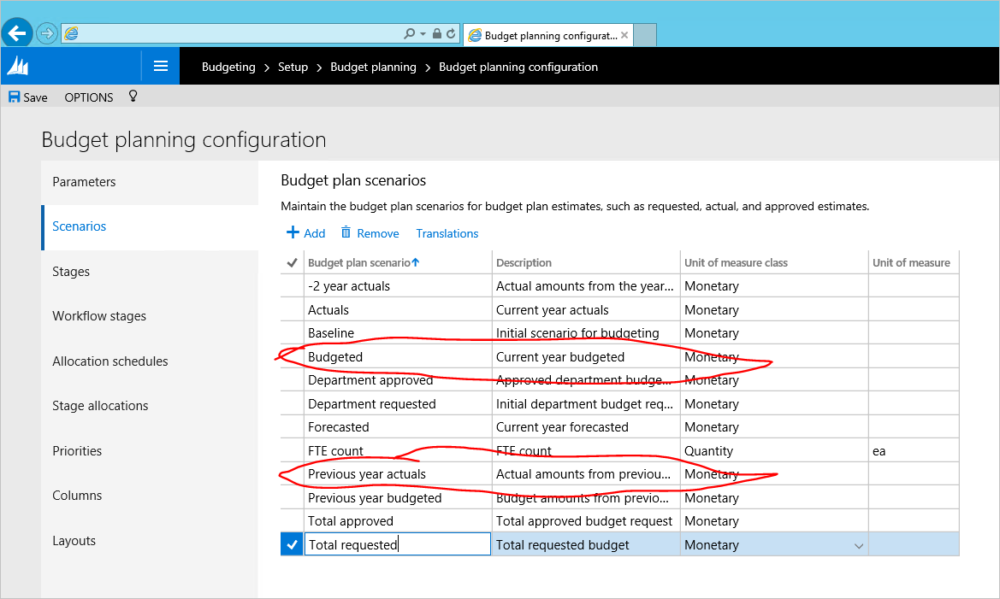](./media/screenshot15.png) 

*Hinweis: Da Julia nicht dem formalen Genehmigungsprozess für die Budgetausarbeitung folgt, überspringen wir Workflows, Phasen und Workflowphaseneinrichtung in dieser Übungseinheit und verwenden die vorhandenen Einstellungen für den Workflow Automatisch genehmigt. Vgl. dazu Anhang zur Konfiguration von diesem Workflow.*

### Abgabe 4: Budgetplanspalten erstellen
Budgetplanspalten sind entweder monitär- oder mengenbasierte Spalten, die im Budgetplan-Dokumentenlayout verwendet werden können. In unserem Beispiel müssen wir eine Spalte für Vorjahres-Istwerte und 12 Spalten für jeden Monat in einem budgetierten Jahr erstellen. Spalten können entweder erstellt werden, indem Sie einfach auf die Schaltfläche "Hinzufügen" klicken und die Werte eintragen, oder mithilfe der "Datenentität". In dieser Übungseinheit verwenden wir "Datenentität", um die Werte einzutragen. 

4.1. Öffnen Sie unter Budgetierung &gt; Einrichtung &gt; Budgetplanung &gt; Budgetplanungskonfiguration die Seite „Spalten“. Klicken Sie in der rechten oberen Ecke das Formulars auf die Schaltfläche „Office“, und wählen Sie Spalten (ungefiltert) aus. 

[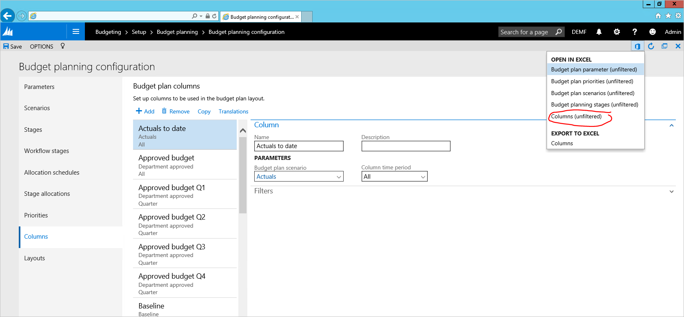](./media/screenshot16.png) 

4.2. Das System öffnet eine Excel-Arbeitsmappe, die zum Ausfüllen der Werte verwendet wird. Klicken Sie bei Aufforderung auf „Bearbeitung aktivieren und dieser App vertrauen“. 

4.3. Es müssen mehrere Spalten vorhanden sein, um Werte einzugeben. Klicken Sie im rechten Bereich auf „Entwurf“, um die Spalten dem Raster hinzuzufügen. 

[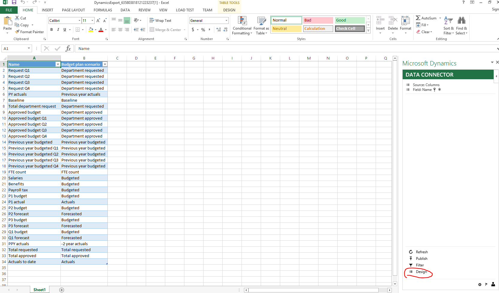](./media/screenshot19.png) 

4.4. Klicken Sie auf die Schaltfläche mit dem Bleistift neben PlanColumns, um die verfügbaren Spalten zu anzuzeigen, die dem Raster hinzugefügt werden können. 

[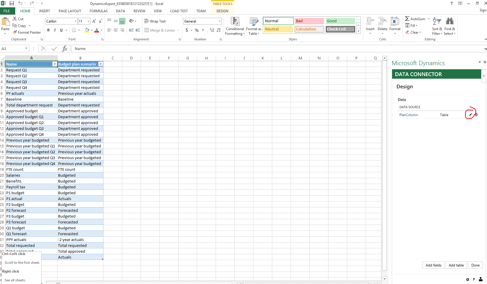](./media/screenshot20.png) 

4.5. Doppelklicken Sie auf jedes verfügbaren Feld, um es zu „Ausgewählte Felder“ hinzuzufügen, und klicken Sie auf „Aktualisieren“. 

4.6. Fügen Sie in der Excel-Tabelle alle Spalten hinzu, die erstellt werden müssen. Verwenden Sie die AutoFill-Funktion in Excel, um die Positionen schnell hinzuzufügen. Stellen Sie sicher, dass die Positionen als Teil der Tabelle hinzugefügt werden (wenn Sie den vertikalen Bildlauf verwenden, sollten Sie die Spaltenüberschriften über dem Raster sehen können). 

4.7. Kehren Sie zur Anwendung zurück und aktualisieren Sie die Seite. Veröffentlichte Werte werden angezeigt. 

[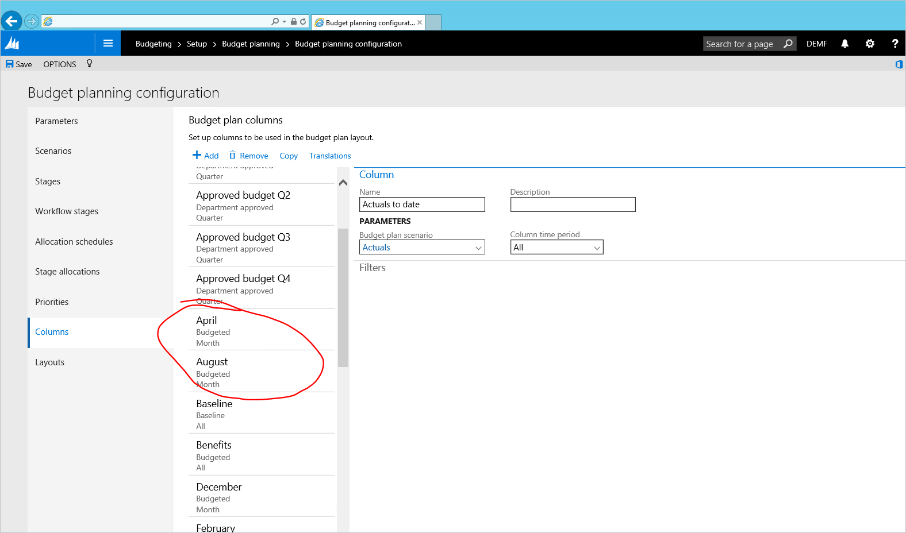](./media/screenshot23.png)

### Abgabe 5:Budgetplan-Dokumentenlayouts und - vorlagen erstellen
Layout definiert, wie das Raster der Budgetsplan-Dokumentenpositionen aussieht, wenn ein Benutzer das Budgetplandokument öffnet. Es ist auch möglich, das Layout des Budgetplandokuments zu wechseln, um dieselben Daten aus verschiedenen Winkeln anzuzeigen. Jetzt, da sie die Spalten definiert hat, die in unserem Budgetplandokument verwendet werden, muss Julia ein Budgetsplan-Dokumentenlayout erstellen, das der Excel-Tabelle ähnlich sieht, das sie verwendet, um Budgetdaten zu erstellen (weitere Informationen finden Sie im Abschnitt Szenarioüberblick in dieser Übungseinheit) 

5.1. Öffnen Sie unter Budgetierung &gt; Einrichtung &gt; Budgetplanung &gt; Budgetplanungskonfiguration die Seite „Layouts“. Erstellen Sie ein neues Layout für den Monatsbudgeteintrag:

-   Wählen Sie den MA+BU-Dimensionssatz, um dem Layout Hauptkonten und Unternehmenseinheiten hinzuzufügen.
-   Führen Sie alle Budgetplanspalten auf, die im vorherigen Schritt im Elementabschnitt erstellt wurden. Machen Sie alle Istwerte aus denen des Vorjahres bearbeitbar.
-   Klicken Sie auf die Schaltfläche "Beschreibungen", um auszuwählen, welche Finanzdimensionen Beschreibungen im Raster anzeigen sollten.

[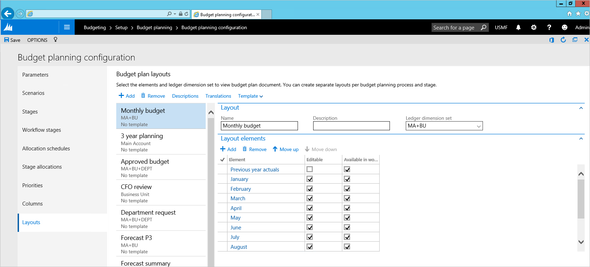](./media/screenshot24.png) 

Auf Grundlage der Budgetplan-Layoutdefinition können wir eine Excel-Vorlage erstellen, die als alternative Methode zur Bearbeitung der Budgetdaten verwendet werden kann. Da die Excel-Vorlage mit der Budgetplan-Layoutdefinition übereinstimmen muss, sind keine Änderungen am Budgetplanlayout mehr möglich, nachdem Sie die Excel-Vorlage generiert haben. Daher sollte diese Aufgabe erfolgen, nachdem alle Layoutkomponenten definiert sind. 

5.2. Für die Layouts, die unter 5,1 erstellt wurden. Schritt, klicken Sie auf die Schaltfläche Vorlage &gt; generieren. Bestätigen Sie die Warnmeldung. Klicken Sie auf "Vorlage &gt;Ansicht. 

*Hinweis Stellen Sie sicher, Speichern auszuwählen und den Ort auszuwählen, an dem die Vorlage gespeichert werden soll, um diese zu bearbeiten. Wenn Benutzer Öffnen im Dialogfeld auswählen, ohne Speichern, werden die Änderungen, die in die Datei geleisteten, nicht beibehalten, wenn die Datei geschlossen wird* 
[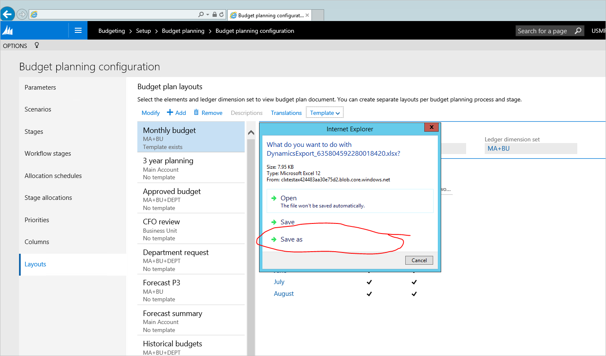](./media/screenshot25.png) 

5.3. &lt; Optionaler Schritt&gt; Ändern Sie die Excel-Vorlage, um sie benutzerfreundlicher zu machen – fügen Sie Addierformeln, Überschriftenfelder, Formatierung usw. hinzu. Speichern Sie die Änderungen, und laden Sie die Datei zum Budgetplanlayout hoch, indem Sie auf Layout &gt; Hochladen klicken. 

### Aufgabe 6: Budgetplanungsprozess erstellen
Julia muss einen neuen Budgetplanungsprozess erstellen und aktivieren, der sämtliche oben genannten Einstellungen kombiniert, um mit der Eingabe von Budgetplänen zu beginnen. Der Budgetplanungsprozess definiert, welche Budgetplanungsorganisationen, Workflows, Layouts und Vorlagen zum Erstellen von Budgetplänen verwendet werden. 

6.1. Navigieren Sie zu Budgetierung &gt; Einrichtung &gt; Budgetplanung &gt; Budgetplanungsprozess, und erstellen Sie einen neuen Datensatz.

-   Budgetplanungsprozess – DEMF-Budgetierung GJ2016
-   Budgetzyklus – GJ2016
-   Sachkonto – DEMF
-   Standardkontostruktur – Herstellungs-GuV
-   Organisationshierarchie – wählen Sie die Hierarchie, die am Anfang der Übungseinheit erstellt wurde aus
-   Budgetplanungsworkflow – weisen Sie den Workflow für automatische Zuweisung für die Finanzabteilung aus
-   Wählen Sie in den hasenregeln und - vorlagen für die Budgetplanung für jede Workflow-Budgetplanungsphase aus, ob das Hinzufügen und das Ändern von Positionen zulässig ist und welches Layout standardmäßig verwendet werden soll

*Hinweis: Sie können zusätzliche Dokumentlayouts erstellen, und sie zuzuordnen, damit sie in der Budgetplanungs-Workflowphase zur Verfügung stehen, indem Sie auf die Schaltfläche "Alternative Layouts" klicken.* 

[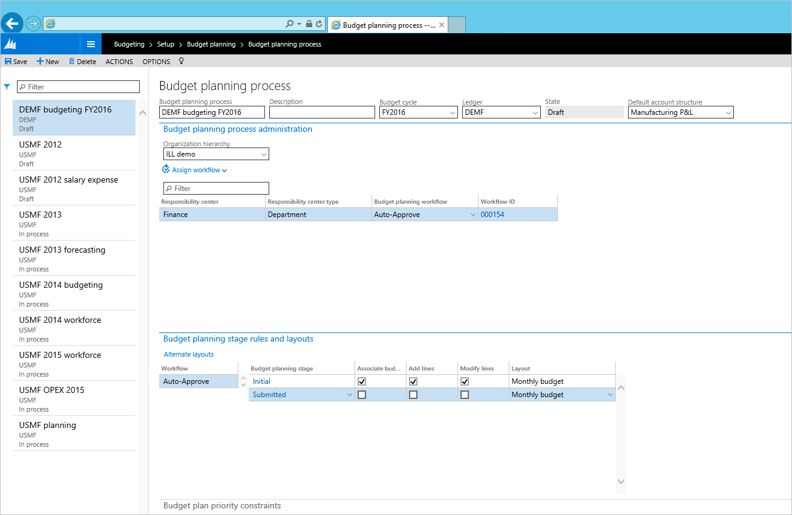](./media/screenshot27.png) 

6.2. Wählen Sie Aktionen &gt; Aktivieren aus, um diesen Budgetplanungsworkflow zu aktivieren. 

[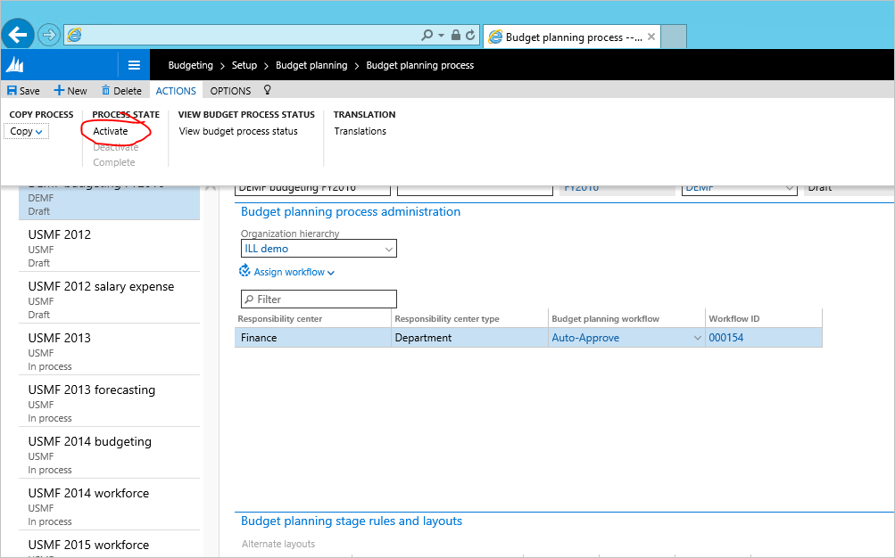](./media/screenshot28.png)

## Übung 2: Prozesssimulation

### Aufgabe 7: Anfängliche Daten für den Budgetplan aus dem Hauptbuch generieren
7.1. Navigieren Sie zu Budgetierung &gt;Periodisch &gt; Budgetplan aus dem Hauptbuch generieren. Füllen Sie die periodischen Prozessparameter aus, klicken Sie auf die Schaltfläche „Generieren“. 

7.2. Navigieren Sie zu Budgetierung &gt; Budgetpläne, um einen Budgetplan zu suchen, der durch den Prozess „Generieren“ erstellt wurde. 

 

7.3. Öffnen Sie Dokumentdetails, indem Sie den Dokumentnummerhyperlink klicken. Der Budgetplan wird im Layout, das während dieser Übungseinheit erstellt wurde, als definiert angezeigt. 

[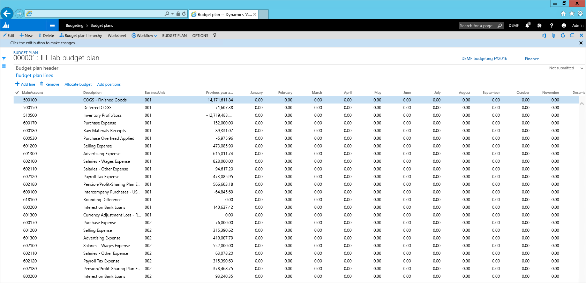](./media/screenshot31.png)

### Aufgabe 8: Budget des aktuellen Jahres auf Grundlage der Vorjahres-Istwerte erstellen
Zuordnungsmethoden können im Budegetplan verwendet werden, um Informationen für Budgetpläne einfach von einem Szenario zu einem anderen zu kopieren/sie über Perioden zu verteilen/Dimensionen zuweisen. Wir verwenden Zuweisungen, um das Budget des aktuellen Jahres aus den Vorjahres-Istwerten zu erstellen. 

8.1. Wählen Sie alle Positionen im Budgetplan-Dokumentenraster, und klicken Sie auf die Schaltfläche „Budget zuteilen“. 

[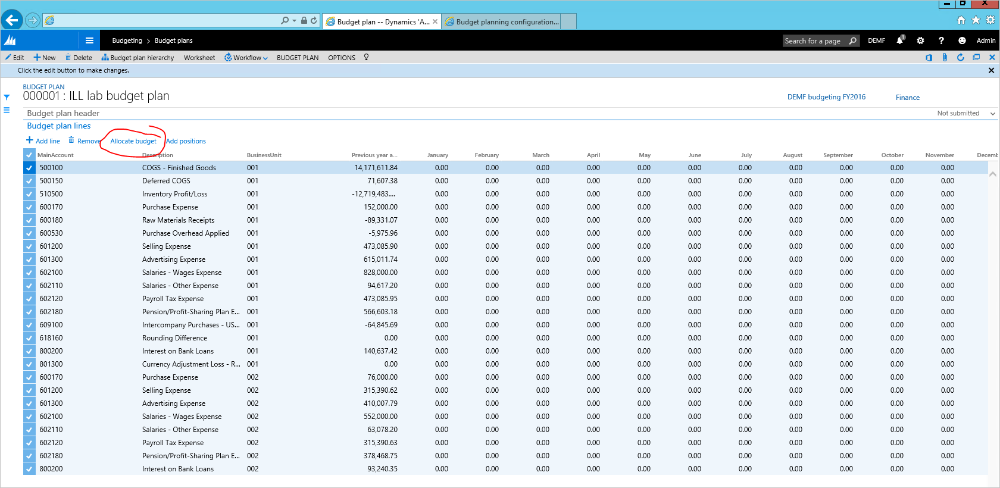](./media/screenshot32.png) 

8.2. Wählen Sie, Zuordnungsmethode Periodenschlüssel, Quelle und Zielszenarien aus, und klicken auf „Zuteilen“. 

[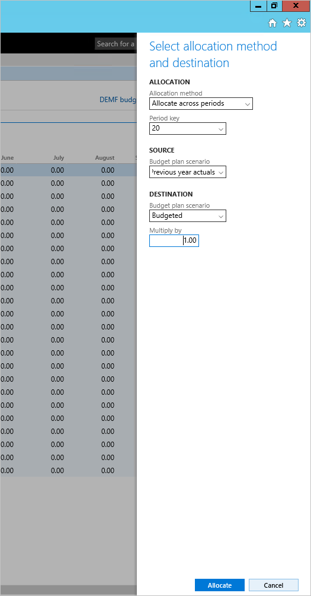](./media/screenshot33.png)

Die tatsächlichen Beträge des vorherigen Jahres werden in das Budget des aktuellen Jahres sowie diese periodenübergreifend mithilfe von Verkaufskurvenperiodenschlüsseln zugewiesen. 

[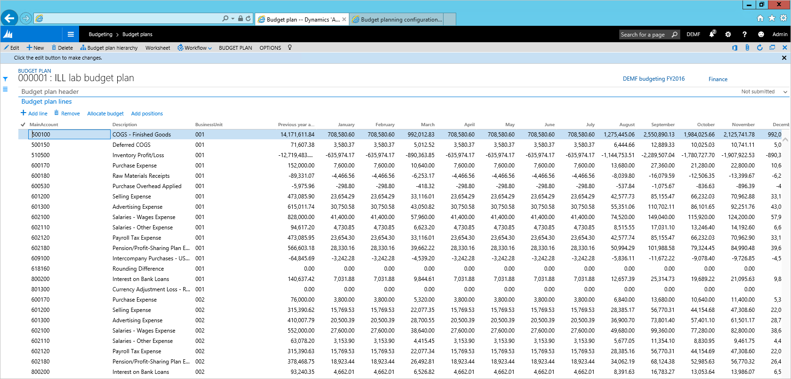](./media/screenshot34.png)

### Abgabe 9: Das Budgetplandokument mithilfe von Excel anpassen und das Dokument fertig stellen
9.1. Klicken Sie auf die Schaltfläche „Arbeitsblatt“, um Dokumentinhalte in Excel zu öffnen.

9.2. Wenn die Excel-Arbeitsmappe geöffnet wird, passen Sie die Nummern im Budgetplandokument an, und klicken Sie auf die Schaltfläche „Veröffentlichen“.

9.3. Kehren Sie zum Budgetplandokument zurück. Klicken Sie auf Workflow &gt; Übermitteln, um das Dokument automatisch zu genehmigen.

 

Wenn der Workflow abgeschlossen ist, wird die Budgetplandokumentphase als „Genehmigt“ angezeigt. 

## Anhang

### Workflowkonfiguration für automatische Genehmigung

A. Budgetierung &gt; Einrichtung &gt; Budgetplanung &gt; Budgetierungsworkflows. Erstellen Sie einen neuen Workflow mithilfe der Vorlage „Budgetplanungsworkflows“:

[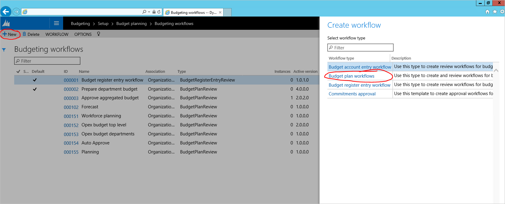](./media/screenshot39.png)

Dieser Workflow enthält nur eine Aufgabe – Phasenübergangsbudgetplan. 

[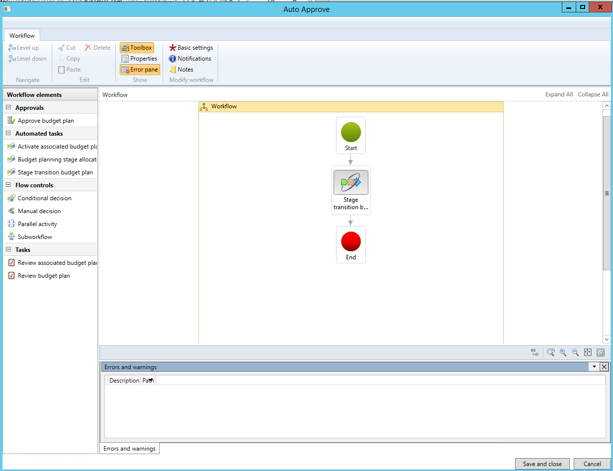](./media/screenshot40.png) 

Speichern und Aktivieren des Workflows. 

B. Navigieren Sie zu Budgetierung &gt; Einrichtung &gt; Budgetplanung&gt; Budgetplanungskonfiguration. Erstellen Sie auf der Registerkarte „Phasen“ 2 Phasen – „Ursprünglich“ und „Übermittelt“. 

[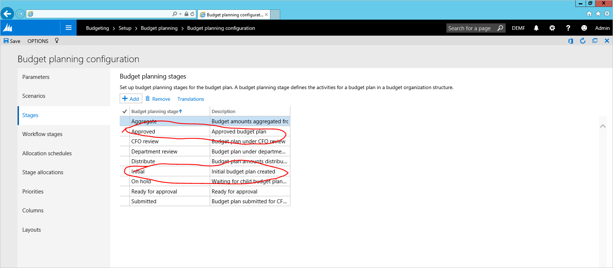](./media/screenshot41.png)

C. Navigieren Sie zu Budgetierung &gt; Einrichtung &gt; Budgetplanung&gt; Budgetplanungskonfiguration. Ordnen Sie auf der Registerkarte „Workflowphasen“ den in Schritt A erstellten Workflow „Automatisch genehmigen“ den Phasen „Ursprünglich“ und „Übermittelt“ zu.

[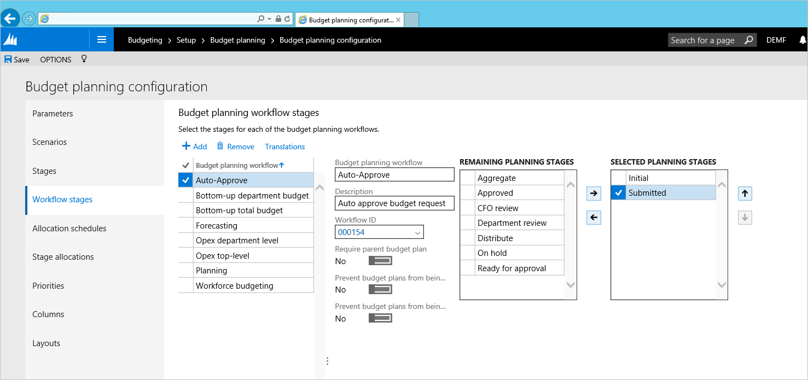](./media/screenshot42.png)  

