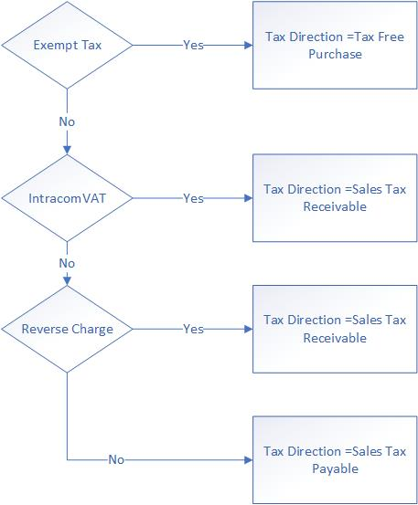
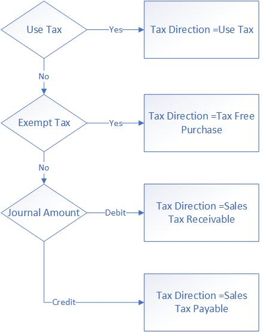

# Mehrwertsteuerberechnung für allgemeine Erfassungspositionen
[!include [banner](../includes/banner.md)]

In diesem Thema wird erläutert, wie die Mehrwertsteuer für verschiedene Kontotypen (Kreditorenkonto, Debitorenkonto, Sachkonto und Projekt) in allgemeinen Erfassungspositionen berechnet werden.

Der Prozess kann in drei Schritte unterteilt werden:

- Ermitteln der Mehrwertsteuerart.

- Festlegen des Mehrwertsteuerbetrags, der in einer temporären Mehrwertsteuertabelle gespeichert wird.

- Bestimmen des Mehrwertsteuerbetrags und des Kontos für den Beleg.

## Ermitteln der Mehrwertsteuerart

Die Methode, mit der die Mehrwertsteuerart bestimmt wird, hängt von der Art des Kontos im Beleg ab. Die Mehrwertsteuerart wird durch die Kombination aus Kontenart und Mehrwertsteuercodes bestimmt. In den folgenden Abschnitten sind die Möglichkeiten ausführlicher aufgeführt. 

### Kontotyp ist Projekt

Wenn ein Beleg eine Erfassungsposition hat, in der die Kontenart **Projekt** ausgewählt ist, gilt für alle Erfassungspositionen im Beleg die gleiche Steuerart. Die folgende Abbildung zeigt die Regel. Folgende Punkte zeigen die möglichen Steuerarten für Projektkonten.

•   Wenn der Mehrwertsteuercode Verbrauchssteuer ist, ist auch die Mehrwert-Steuerart Verbrauchssteuer.

•   Wenn der Mehrwertsteuercode Steuerbefreiung ist, ist die Mehrwertsteuerart Steuerfreier Einkauf.

•   Wenn der Mehrwertsteuercode innergemeinschaftliche Mehrwertsteuer ist, ist die Mehrwertsteuerart Mehrwertsteuer.

•   Wenn der Mehrwertsteuercode Verlagerung der Steuerschuld ist, ist die Mehrwertsteuerart Mehrwertsteuer.

Andernfalls ist die Mehrwertsteuerart Vorsteuer.

Das folgende Diagramm veranschaulicht diese Regel grafisch.

### Der Kontentyp ist Kreditor.

Wenn ein Beleg eine Erfassungsposition hat, in der die Kontenart **Kreditor** ausgewählt ist, gilt für alle Erfassungspositionen im Beleg die gleiche Steuerart. Folgende Punkte zeigen die möglichen Steuerarten für Kreditorenkonten. 

•   Wenn der Mehrwertsteuercode Verbrauchssteuer ist, ist auch die Mehrwert-Steuerart Verbrauchssteuer.

•   Wenn der Mehrwertsteuercode Steuerbefreiung ist, ist die Mehrwertsteuerart Steuerfreier Einkauf.

•   Wenn der Mehrwertsteuercode innergemeinschaftliche Mehrwertsteuer ist, ist die Mehrwertsteuerart Mehrwertsteuer.

•   Wenn der Mehrwertsteuercode Verlagerung der Steuerschuld ist, ist die Mehrwertsteuerart Mehrwertsteuer.

Andernfalls ist die Mehrwertsteuerart Vorsteuer.

Das folgende Diagramm veranschaulicht diese Regel grafisch.

### Kontotyp ist Debitor

Wenn ein Beleg eine Erfassungsposition hat, in der die Kontenart **Debitor** ausgewählt ist, gilt für alle Erfassungspositionen im Beleg die gleiche Steuerart. Folgende Punkte zeigen die möglichen Steuerarten für Debitorenkonten.

•   Wenn der Mehrwertsteuercode Steuerbefreiung ist, ist die Mehrwertsteuerart Steuerfreier Einkauf.

•   Wenn der Mehrwertsteuercode innergemeinschaftliche Mehrwertsteuer ist, ist die Mehrwertsteuerart Vorsteuer.

•   Wenn der Mehrwertsteuercode Verlagerung der Steuerschuld ist, ist die Mehrwertsteuerart Vorsteuer.

Andernfalls ist die Mehrwertsteuerart Mehrwertsteuer.

Das folgende Diagramm veranschaulicht diese Regel grafisch.

### Kontentyp ist Sachkonto

Die folgende Abbildung zeigt die Regel an, die angewendet werden soll, wenn nur ein Beleg Erfassungspositionen aufweist, in denen die Kontenart **Sachkonto** ausgewählt ist. Folgende Punkte zeigen die möglichen Steuerarten für Sachkonten.

•   Wenn der Mehrwertsteuercode Verbrauchssteuer ist, ist auch die Mehrwert-Steuerart Verbrauchssteuer.

•   Wenn der Mehrwertsteuercode Steuerbefreiung ist, ist die Mehrwertsteuerart Steuerfreier Einkauf.

Wenn der Erfassungsbetrag andernfalls Soll (positiv) ist, ist die Mehrwertsteuerart Vorsteuer; wenn der Erfassungsbetrag Gutschrift (negativ) ist, ist die Mehrwertsteuerart Mehrwertsteuer.

Das folgende Diagramm veranschaulicht diese Regel grafisch.

#### Überschreiben der Mehrwertsteuerart

Sie können die Mehrwertsteuerart überschreiben, wenn der Beleg nur Positionen enthält, in denen die Kontenart **Sachkonto** ausgewählt ist.

Navigieren Sie zu **Hauptbuch \> Kontenplan \> Konten \> Hauptkonten** und wählen Sie das Inforegister **Juristische Person überschreibt** aus.

## Ermitteln des Mehrwertsteuerbetrags

Dieser Abschnitt beschreibt, wie das Vorzeichen des Mehrwertsteuerbetrags berechnet wird.

Die folgende Tabelle zeigt die generische Regel zum Bestimmen der Vorzeichen von Mehrwertsteuerbeträgen in der temporären Mehrwertsteuertabelle.

| Erfassungspositionbetrag | Mehrwertsteuerart  | Mehrwertsteuerbetrag-Zeichen |
|---------------------|----------------------|-----------------------|
| Positiv            | Vorsteuer | Positiv              |
| Positiv            | Mehrwertsteuer    | Negativ              |
| Negativ            | Vorsteuer | Negativ              |
| Negativ            | Mehrwertsteuer    | Positiv              |

Es gibt eine Sonderregelung für Belege, die nur Positionen **Projekt** oder **Sachkonto** besitzen, wenn eine Mehrwertsteuergruppe und eine Artikel-Mehrwertsteuergruppe in der Position **Sachkonto** ausgewählt wurde. Diese Regel wird durch Aktivieren der unabhängigen Mehrwertsteuerberechnungsfunktion für allgemeine Erfassungen gesteuert. Wenn diese Funktion deaktiviert wird, verwendet der Steuerbetrag der **Sachkonto**-Position die Soll-/Kreditrichtung der Position **Projekt**. Wenn diese Funktion deaktiviert wird, verwendet der Steuerbetrag **Sachkonto**-Position seine eigene Soll-/Kreditrichtung. Die folgenden Tabellen zeigen die Regel für jedes Szenario an. 

**Regel, wenn die Funktion aktiviert ist.**

| Erfassungspositionsbetrag des Projekts | Mehrwertsteuerart  | Mehrwertsteuerbetrag-Zeichen |
|--------------------------------|----------------------|-----------------------|
| Positiv                       | Vorsteuer | Positiv              |
| Negativ                       | Vorsteuer | Negativ              |

**Regel, wenn die Funktion deaktiviert ist.**

| Erfassungspositionsbetrag des Sachkontos  | Mehrwertsteuerart  | Mehrwertsteuerbetrag-Zeichen |
|--------------------------------|----------------------|-----------------------|
| Positiv                       | Vorsteuer | Positiv              |
| Negativ                       | Vorsteuer | Negativ              |

## Bestimmen des Mehrwertsteuerbetrags und des Kontos für den Beleg

Wenn Sie Mehrwertsteuern buchen, wird das Hauptkonto aus dem Sachkontobuchungsgruppenprofil abgerufen. Wenn Mehrwertsteuer zu erstatten ist, verwendet das System das Konto für die Vorsteuer, das im Profil angegeben wird. Wenn Mehrwertsteuer zu zahlen sind, verwendet das System das Konto für die Mehrwertsteuer, das im Profil angegeben wird.

Die allgemeine Regel wird in der folgenden Tabelle veranschaulicht.

| Mehrwertsteuerart  | Mehrwertsteuerbetrag-Zeichen | Mehrwertsteuerkonto      | Belegbetrag |
|----------------------|-----------------------|------------------------|-------------------|
| Vorsteuer | Positiv              | Vorsteuerkonten | Positiv (Soll)  |
| Vorsteuer | Negativ              | Vorsteuerkonten | Negativ (Haben)  |
| Mehrwertsteuer    | Positiv              | Mehrwertsteuerkonten    | Negativ (Haben)  |
| Mehrwertsteuer    | Negativ              | Mehrwertsteuerkonten    | Positiv (Soll)  |
