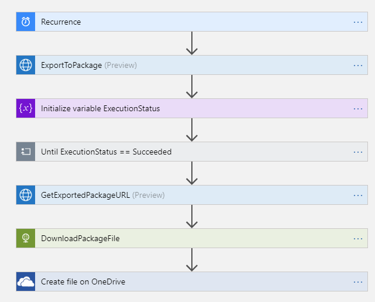
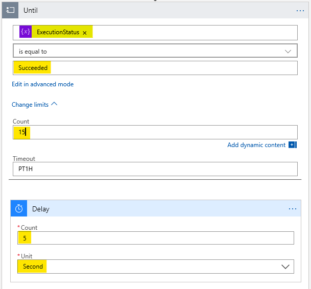
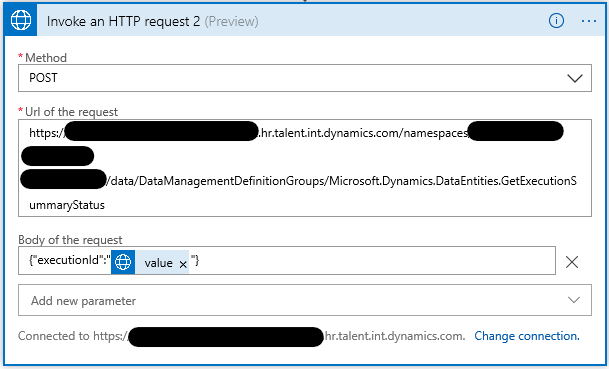
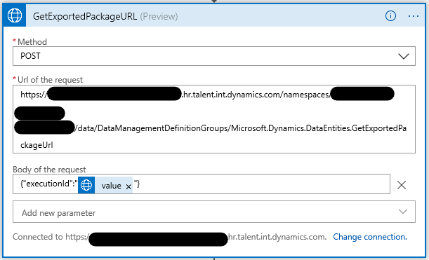
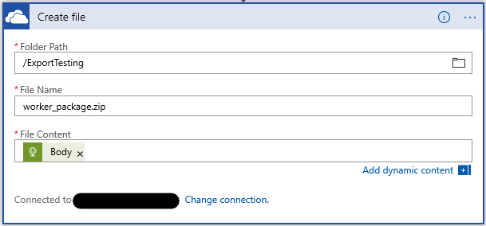
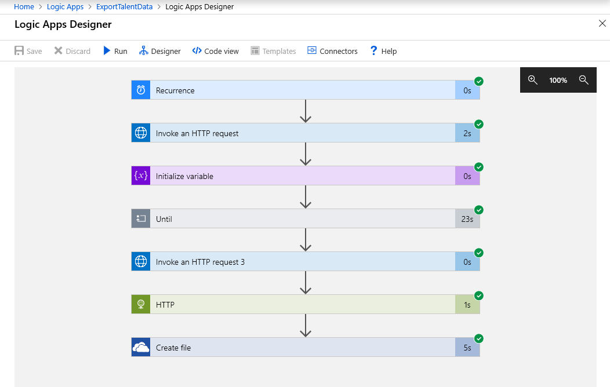

# <a name="create-a-recurring-data-export-app"></a>App für wiederkehrenden Datenexport erstellen

Dieser Artikel zeigt das Erstellen einer Microsoft Azure Logic App, die regelmäßig nach einem Zeitplan Daten aus Microsoft Dynamics 365 Human Resources exportiert. Das Tutorial nutzt die Vorteile der REST-Anwendungsprogrammierschnittstelle (API) des Human Resources-DMF-Pakets, um die Daten zu exportieren. Nachdem die Daten exportiert wurden, speichert die Logic App das exportierte Datenpaket in einem Microsoft OneDrive for Business-Ordner.

## <a name="business-scenario"></a>Geschäftsszenario

In einem typischen Geschäftsszenario für Microsoft Dynamics 365-Integrationen müssen Daten regelmäßig nach einem festen Zeitplan in ein nachgeschaltetes System exportiert werden. Dieses Tutorial zeigt, wie Sie alle Arbeitskraft-Datensätze von Microsoft Dynamics 365 Human Resources exportieren und die Liste der Arbeitskräfte in einem OneDrive for Business-Ordner speichern.

> [!TIP]
> Die spezifischen Daten, die in diesem Tutorial exportiert werden, sowie das Ziel der exportierten Daten sind nur Beispiele. Sie können sie einfach ändern und an Ihre Unternehmensanforderungen anpassen.

## <a name="technologies-used"></a>Verwendete Technologien

In diesem Tutorial werden die folgenden Technologien verwendet:

- **[Dynamics 365 Human Resources](https://dynamics.microsoft.com/talent/overview/)**- Die Stammdatenquelle für die zu exportierenden Arbeitskräfte.
- **[Azure Logic Apps](https://azure.microsoft.com/services/logic-apps/)** – Die Technologie zur Orchestrierung und Planung des wiederkehrenden Exports.

    - **[Connector](https://docs.microsoft.com/azure/connectors/apis-list)** – Die Technologie, mit der die Logic App mit den erforderlichen Endpunkten verbunden wird.

        - [HTTP mit Azure AD](https://docs.microsoft.com/connectors/webcontents/)-Connector
        - [OneDrive for Business](https://docs.microsoft.com/azure/connectors/connectors-create-api-onedriveforbusiness)-Connector

- **[DMF-Paket REST-API](../dev-itpro/data-entities/data-management-api.md)** – Die Technologie, die zum Auslösen des Exports und zum Überwachen des Fortschritts verwendet wird.
- **[OneDrive for Business](https://onedrive.live.com/about/business/)** – Das Ziel für die exportierten Arbeitskräfte.

## <a name="prerequisites"></a>Voraussetzungen

Bevor Sie mit der Übung in diesem Tutorial beginnen, muss Folgendes gegeben sein:

- Eine Human Resources-Umgebung, die über Berechtigungen auf Administratorebene in der Umgebung verfügt
- Ein [Azure-Abonnement](https://azure.microsoft.com/free/), um die Logic App zu hosten

## <a name="the-exercise"></a>Übung

Am Ende dieser Übung steht Ihnen eine Logic App zur Verfügung, die mit Ihrer Human Resources-Umgebung und Ihrem OneDrive for Business-Konto verbunden ist. Die Logic App exportiert ein Datenpaket aus Human Resources. Warten Sie, bis der Export abgeschlossen ist. Laden Sie das exportierte Datenpaket herunter und speichern Sie das Datenpaket im OneDrive for Business-Ordner, den Sie angegeben haben.

Die fertige Logic App ähnelt der folgenden Abbildung.



### <a name="step-1-create-a-data-export-project-in-human-resources"></a>Schritt 1: Erstellen eines Datenexportprojekts in Human Resources

Erstellen Sie in Human Resources ein Datenexportprojekt, das Arbeitskräfte exportiert. Nennen Sie das Projekt **Export Workers** und stellen Sie sicher, dass die Option **Datenpaket generieren** auf **Ja** gesetzt ist. Fügen Sie eine einzelne Entität (**Arbeitskraft**) zum Projekt hinzu und wählen Sie das Format aus, in das exportiert werden soll. (Microsoft Excel-Format wird in diesem Tutorial verwendet.)


> [!IMPORTANT]
> Merken Sie sich den Namen des Datenexportprojekts. Sie benötigen ihn, wenn Sie im nächsten Schritt die Logic App erstellen.

### <a name="step-2-create-the-logic-app"></a>Schritt 2: Erstellen der Logic App

Der Großteil der Übung besteht darin, die Logic App zu erstellen.

1. Erstellen Sie im Azure-Portal eine Logic App.

    

2. Beginnen Sie im Logic Apps Designer mit einer leeren Logic App.
3. Fügen Sie einen [Auslöser für einen Serienzeitplan](https://docs.microsoft.com/azure/connectors/connectors-native-recurrence) hinzu, um die Logic App alle 24 Stunden (oder nach einem Zeitplan Ihrer Wahl) auszuführen.

    

4. Rufen Sie die [ExportToPackage](../dev-itpro/data-entities/data-management-api.md#exporttopackage) DMF-REST-API zum Planen des Exports Ihres Datenpakets auf.

    1. Verwenden Sie die Aktion für **HTTP-Anfrage aufrufen** über den HTTP mit Azure AD-Connector auf.

        - **Basisressourcen-URL:** Die URL Ihrer Human Resources-Umgebung (keine Pfad-/Namespace-Informationen einschließen.)
        - **Azure AD Ressourcen-URI:** `http://hr.talent.dynamics.com`

        > [!NOTE]
        > Der Human Resources-Dienst stellt noch keinen Connector bereit, der alle APIs verfügbar macht, aus denen die REST-API des DMF-Pakets besteht, beispielsweise **ExportToPackage**. Stattdessen müssen Sie die APIs mithilfe von rohen HTTPS-Anforderungen über den HTTP mit Azure AD-Connector aufrufen. Dieser Connector verwendet Azure Active Directory (Azure AD) zur Authentifizierung und Autorisierung gegenüber Human Resources.

        

    2. Melden Sie sich in der Human Resources-Umgebung über HTTP mit Azure AD-Connector an.
    3. Richten Sie eine HTTP-**POST**-Anforderungen ein, um die **ExportToPackage**-DMF-REST-API aufzurufen.

        - **Methode:** POST
        - **URL der Anforderung:** https://\<hostname\>/namespaces/\<namespace\_guid\>/data/DataManagementDefinitionGroups/Microsoft.Dynamics.DataEntities.ExportToPackage
        - **Text der Anforderung:**

            ```JSON
            {
                "definitionGroupId":"Export Workers",
                "packageName":"talent_package.zip",
                "executionId":"",
                "reExecute":false,
                "legalEntityId":"USMF"
            }
            ```

        

    > [!TIP]
    > Möglicherweise möchten Sie die einzelnen Schritte umbenennen, damit deren Bedeutung klarer wird als der Standardname **HTTP-Anforderung aufrufen**. Sie können diesen Schritt beispielsweise umbenennen in **ExportToPackage**.

5. [Initialisieren Sie eine Variable](https://docs.microsoft.com/azure/logic-apps/logic-apps-create-variables-store-values#initialize-variable), um den Ausführungsstatus der **ExportToPackage**-Anforderung zu speichern.

    

6. Warten Sie, bis der Ausführungsstatus des Datenexports **Erfolgreich** ist.

    1. Fügen Sie eine [Bis-Schleife](https://docs.microsoft.com/azure/logic-apps/logic-apps-control-flow-loops#until-loop) hinzu, die wiederholt wird, bis der Wert der **ExecutionStatus**-Variable **Erfolgreich** lautet.
    2. Fügen Sie eine **Verzögern**-Aktion hinzu, durch die fünf Sekunden gewartet wird, bevor der aktuelle Ausführungsstatus des Exports abgefragt wird.

        

        > [!NOTE]
        > Setzen Sie den Grenzwert auf **15**, damit maximal 75 Sekunden gewartet wird (15 Iterationen × 5 Sekunden), bis der Export abgeschlossen ist. Wenn Ihr Export länger dauert, passen Sie den Grenzwert entsprechend an.        

    3. Fügen Sie eine **HTTP-Anforderung aufrufen**-Aktion zum Aufrufen der [GetExecutionSummaryStatus](../dev-itpro/data-entities/data-management-api.md#getexecutionsummarystatus)-DMF-REST-API hinzu und setzen Sie die **ExecutionStatus**-Variable auf das Ergebnis der **GetExecutionSummaryStatus**-Antwort.

        > Dieses Beispiel führt keine Fehlerprüfung durch. Die **GetExecutionSummaryStatus**-API kann nicht erfolgreiche Terminalzustände zurückgeben (also andere Zustände als **Erfolgreich**). Weitere Informationen finden Sie in der [API-Dokumentation](../dev-itpro/data-entities/data-management-api.md#getexecutionsummarystatus).

        - **Methode:** POST
        - **URL der Anforderung:** https://\<hostname\>/namespaces/\<namespace\_guid\>/data/DataManagementDefinitionGroups/Microsoft.Dynamics.DataEntities.GetExecutionSummaryStatus
        - **Hauptteil der Anforderung:** body('Invoke\_an\_HTTP\_request')?['value']

            > [!NOTE]
            > Möglicherweise müssen Sie den **Hauptteil der Anforderung**-Wert in der Codeansicht oder im Funktionseditor im Designer eingeben.

        

        

        > [!IMPORTANT]
        > Der Wert für die **Variable festlegen**-Aktion (**body('Invoke\_an\_HTTP\_request\_2')?['value']**) unterscheidet sich vom Wert für den **HTTP-Anforderung aufrufen 2**-Hauptteilwert, auch wenn der Designer die Werte auf gleiche Weise anzeigt.

7. Erhalten Sie die Download-URL für das exportierte Paket.

    - Fügen Sie eine **HTTP-Anforderung aufrufen**-Aktion hinzu, um die [GetExportedPackageUrl](../dev-itpro/data-entities/data-management-api.md#getexportedpackageurl)-DMF-REST-API aufzurufen.

        - **Methode:** POST
        - **URL der Anforderung:** https://\<hostname\>/namespaces/\<namespace\_guid\>/data/DataManagementDefinitionGroups/Microsoft.Dynamics.DataEntities.GetExportedPackageUrl
        - **Hauptteil der Anforderung:** {"executionId": body('GetExportedPackageURL')?['value']}

        

8. Laden Sie das exportierte Paket herunter.

    - Fügen Sie eine HTTP-**GET**-Anforderung (eine integrierte [HTTP-Connector-Aktion](https://docs.microsoft.com/azure/connectors/connectors-native-http)) hinzu, um das Paket von der URL herunterzuladen, die im vorherigen Schritt zurückgegeben wurde.

        - **Methode:** GET
        - **URI:** body('Invoke\_an\_HTTP\_request\_3').value

            > [!NOTE]
            > Möglicherweise müssen Sie den **URI**-Wert in der Codeansicht oder im Funktionseditor im Designer eingeben.

        

        > [!NOTE]
        > Diese Anforderung erfordert keine zusätzliche Authentifizierung, da die URL, die die **GetExportedPackageUrl**-API zurückgibt, ein Token für gemeinsame Zugriffssignaturen enthält, mit dem der Zugriff zum Herunterladen der Datei gewährt wird.

9. Speichern Sie das heruntergeladene Paket mit dem [OneDrive for Business](https://docs.microsoft.com/azure/connectors/connectors-create-api-onedriveforbusiness)-Connector.

    - Fügen Sie eine OneDrive for Business [Datei erstellen](https://docs.microsoft.com/connectors/onedriveforbusinessconnector/#create-file)-Aktion hinzu.
    - Stellen Sie eine Verbindung zu Ihrem OneDrive for Business-Konto her, wenn erforderlich.

        - **Ordnerpfad:** Ein Ordner Ihrer Wahl
        - **Dateiname:** worker\_package.zip
        - **Dateiinhalt:** Der Hauptteil aus dem vorherigen Schritt (dynamischer Inhalt)

        

### <a name="step-3-test-the-logic-app"></a>Schritt 3: Testen der Logic App

Um Ihre Logic App zu testen, wählen Sie im Designer **Ausführen** aus. Sie werden sehen, dass die Schritte der Logic App ausgeführt werden. Nach 30 bis 40 Sekunden sollte die Logic App-Ausführung beendet sein und Ihr OneDrive for Business-Ordner sollte eine neue Paketdatei enthalten, die die exportierten Arbeitskräfte enthält.

Wenn für einen Schritt ein Fehler gemeldet wird, wählen Sie den fehlgeschlagenen Schritt im Designer aus und überprüfen Sie die Felder **Eingaben** und **Ausgaben** für diesen. Debuggen Sie und passen Sie den Schritt nach Bedarf an, um die Fehler zu beheben.

Die folgende Abbildung zeigt, wie der Logic Apps Designer aussieht, wenn alle Schritte der Logic App erfolgreich ausgeführt wurden.



## <a name="summary"></a>Summe

In diesem Tutorial haben Sie gelernt, wie Sie mit einer Logic App Daten aus Human Resources exportieren und die exportierten Daten in einem OneDrive for Business-Ordner speichern. Sie können die Schritte dieses Tutorials nach Bedarf an Ihre geschäftlichen Anforderungen anpassen.


