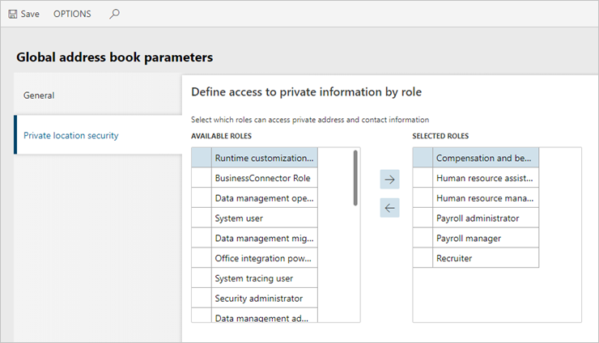

# Zugriff auf private Adressen nach Sicherheitsrolle

**Abgang**

Nachdem ein Kunde eine Sicherheitsrolle dupliziert und sich als diese neue Rolle anmeldet, kann der Kunde die Adressen, die als privat markiert wurden, nicht sehen.

**Auflösung**

Um das Problem zu beheben, muss der Kunde diese Schritte für die duplizierte Sicherheitsrolle befolgen.

1. Wechseln Sie zu **Organisationsverwaltung \> Globales Adressbuch \> Parameter für das globale Adressbuch**.
2. Auf der Registerkarte **Sicherheit für private Standorte** verschieben Sie die neue Sicherheitsrolle von der Liste **Verfügbare Rollen** in die Liste **Ausgewählte Rollen**.
3. Wählen Sie **Speichern**.

