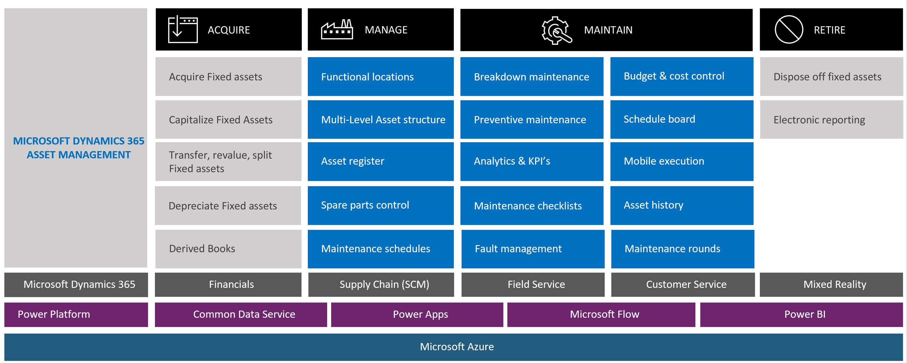

# Überblick über die Anlagenverwaltung

[!include [banner](../includes/banner.md)]

Asset Management ist ein erweitertes Modul für die Verwaltung von Anlagen und Wartungsaufgaben in Dynamics 365 Supply Chain Management. Anlagenmanagement integriert nahtlos in mehrere Module in Finance and Operations Apps integriert. 

Das folgende Bild ist eine Darstellung der Schnittstellen zu anderen Modulen in Finance and Operations.

Asset Management ermöglicht Ihnen, Aufgaben in Bezug auf die Verwaltung und Wartung zahlreicher Ausrüstungen in Ihrem Unternehmen, z. B. Maschinen, Produktionsanlagen und Fahrzeuge, effizient zu verwalten und auszuführen. Asset Management unterstützt Lösungen über zahlreiche Branchen hinweg.
