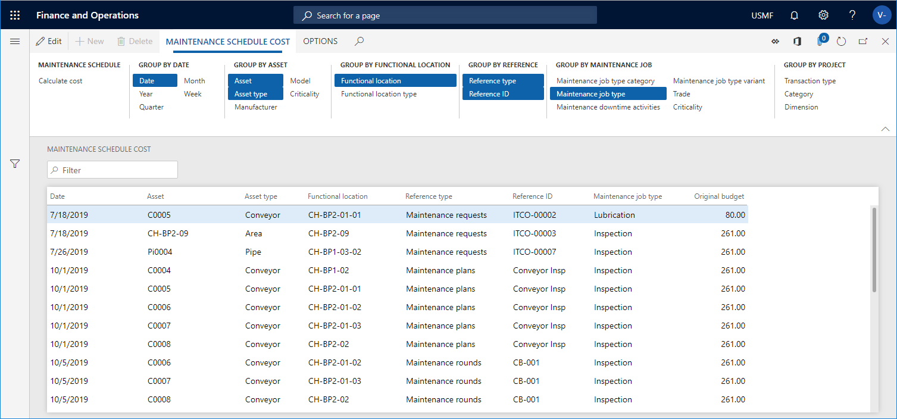

# Kosten – Wartungszeitplan

[!include [banner](../../includes/banner.md)]

 

In Asset-Management können Sie Budgetkosten auf Wartungszeitplanpositionen berechnen. Dies ist nützlich, wenn Sie sich einen Überblick über zu erwartenden Kosten verschaffen möchten, z.B. Kosten für geplante vorbeugende Wartungsaufträge für das nächste Jahr. Die Berechnungen basieren auf vorhandenen Wartungszeitplanpositionen vom Typ „Wartungspläne“ und „Wartungsdurchgänge“ und „Wartungsanfragen“.

1. Klicken Sie auf **Anlagenverwaltung** > **Abfragen** > **Anlagen** > **Wartungszeitplankosten**.

2. Im Dialog **Wartungszeitplankosten** können Sie einen **Finanzdimensionssatz** auswählen, wenn Sie die Kosten nach Finanzdimensionen gruppieren möchten.

>[!NOTE]
>Finanzdimensionssätze werden in **Hauptbuch** > **Kontenplan** > **Dimensionen** > **Finanzdimensionssätze** eingerichtet.

3. Sie können das Feld **Ebene** verwenden, um anzugeben, wie detailliert der Wartungszeitplan bezüglich funktionaler Standorte sein sollen. Wenn Sie beispielsweise die Zahl „1“ im Feld einfügen und eine funktionale Standortstruktur auf mehreren Ebenen haben, werden alle Wartungszeitplanpositionen für einen funktionalen Standort auf der höchsten Ebene angezeigt, und daher werden die Stunden in einer Position von den funktionalen Standorten auf einer niedrigeren Ebene hinzugefügt. Wenn Sie die Zahl „0“ im Feld **Ebene** eingeben, wird ein detailliertes Ergebnis mit allen Wartungszeitplanpositionen für alle funktionalen Standortebenen angezeigt, denen sie zugeordnet sind.

4. Wenn Sie eine Berechnung für bestimmte Anlagen durchführen möchten, klicken Sie auf **Filter** auf dem Inforegister **Einzuschließende Datensätze**, und wählen Sie die entsprechenden Anlagen aus. Bei Bedarf können Sie auch einen **Voraussichtlichen Starttermin** für die Kostenkalkulation angeben oder einen anderen **Status** für die Kostenkalkulation auswählen.

5. Klicken Sie zum Starten der Kostneberechnung auf **OK**.

6. Klicken Sie auf der Registerkarte **Wartungszeitplankosten** > in den Aktivitätsbereichsgruppen **Gruppieren nach...** auf die entsprechenden Schaltflächen, um die gewünschten Detailstufe der Kostenkalkulation anzuzeigen. Die ausgewählten Aktionsbereichsgruppenschaltflächen werden hervorgehoben. Klicken Sie auf eine Schaltfläche, um sie zu aktivieren oder zu deaktivieren.

7. Klicken Sie auf die Schaltfläche **Kosten berechnen**, wenn Sie eine neue Kostenberechnung vornehmen möchten.

In der folgende Abbildung wird die Ergebnisse einer Wartungsplankostenberechnung angezeigt.

