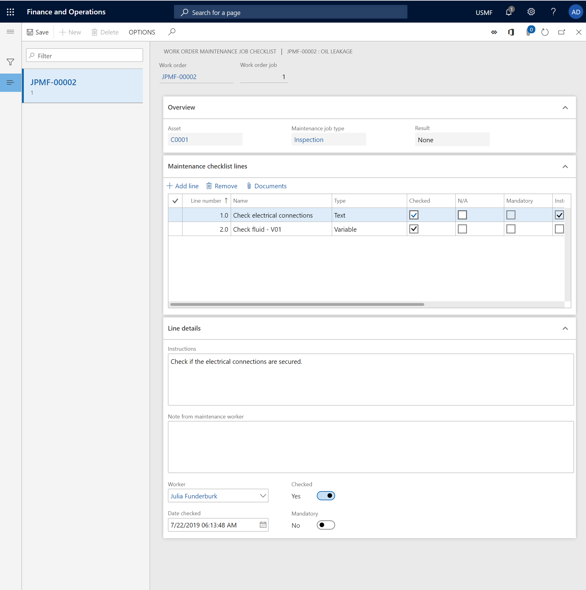

# Wartungsprüflisten

[!include [banner](../../includes/banner.md)]

Wartungsprüflisten werden für Wartungsauftragstypen eingerichtet. Das Ausfüllen von Wartungsprüflisten ist Teil des Abschlusses eines Arbeitsauftrags. Weitere Informationen zum Einrichten von Wartungsprüflisten für Wartungsauftragstypen auf der Seite **Wartungsauftragstyp-Standardwerte** finden Sie unter [Wartungsauftragstypkategorien und Wartungsauftragstypen, Wartungsauftragstypvarianten, Wartungsauftragsbranchen und Wartungsprüflisten](../setup-for-work-orders/job-groups-and-job-types-variants-trades-and-checklists.md).

Wenn Sie mit Wartungsprüflisten an einem Arbeitsauftrag arbeiten, können Sie die vordefinierten Wartungsprüflisten ausfüllen, die sich auf Wartungsauftragstypen beziehen. Sie können auch mehrere Wartungsprüflisten hinzufügen.

## Ausfüllen einer Wartungsprüfliste

1. Klicken Sie auf **Anlagenmanagement** > **Allgemein** > **Arbeitsaufträge** > **Alle Arbeitsaufträge** oder **Aktive Arbeitsaufträge**.

2. Wählen Sie den Arbeitsauftrag aus, und wählen Sie dann im Aktivitätsbereich auf der Registerkarte **Arbeitsauftrag** in der Gruppe **Positionen** **Wartungsprüfliste** aus.

3. In **Wartungsprüfliste für Arbeitsaufträge** finden Sie Prüflisten für alle Arbeitsauftragseinzelvorgänge. Wenn die Arbeitsauftragseinzelvorgänge unterschiedliche Wartungsauftragstypen haben, können die Wartungsprüflisten für jeden Arbeitsauftragseinzelvorgang unterschiedlich sein. Wählen Sie einen Arbeitsauftragseinzelvorgang aus, um mit der entsprechenden Wartungsprüfliste zu arbeiten. Details zu einer ausgewählten Wartungsprüflistenposition werden im Inforegister **Positionsdetails** angezeigt.

4. Schließen Sie alle Wartungsprüflistenpositionen nacheinander in der Reihenfolge ab, in der sie angezeigt werden. Sie schließen eine Wartungsprüflistenposition ab, indem Sie die Felder im Inforegister **Positionsdetails** ausfüllen. Die Informationen, die erforderlich sind, um eine Position abschließen zu können, können je nach Positionstyp variieren. Beispielsweise fügen Sie in einer Position vom Typ **Text** einen Hinweis hinzu, der das Ergebnis der Prüfung erklärt. In einer Position vom Typ **Messung** geben Sie den Zählerwert ein, den Sie am Gerät ablesen, und ebenso bei Bedarf einen Hinweis. Eine Wartungsprüflistenposition vom Typ **Kopfzeile** wird als Überschrift verwendet, um die folgenden Wartungsprüflistenpositionen zu gruppieren. Sie müssen keinen Kopf ausfüllen. Bei allen anderen Arten von Wartungsprüflistenpositionen können Sie einen Hinweis zu einer Position des Typs **Kopfzeile** hinzufügen.

5. Wenn sich Anweisungen auf eine Wartungsprüflistenposition beziehen, ist das Kontrollkästchen **Anweisungen** aktiviert. Lesen Sie die Anweisungen für die ausgewählte Wartungsprüflistenposition im Feld **Anweisungen** im Inforegister **Positionsdetails**.

6. Wenn Sie eine Wartungsprüflistenposition abgeschlossen haben, aktivieren Sie das Kontrollkästchen **Geprüft** auf dieser Position, um sie als abgeschlossen zu kennzeichnen. Wenn Sie eine Wartungsprüflistenposition verwerfen möchten, weil sie für den Arbeitsauftragseinzelvorgang nicht relevant ist, aktivieren Sie das Kontrollkästchen **N/V** auf der Position. Wenn das Kontrollkästchen **Obligatorisch** für eine Wartungsprüflistenposition aktiviert ist, müssen Sie das Kontrollkästchen **Geprüft** oder **N/V** aktivieren.

>[!NOTE]
>Sie können Wartungsprüflistenerfassung nur aktualisieren, wenn sich der Arbeitsauftrag im Lebenszyklusstatus [Aktiv](../setup-for-work-orders/work-order-lifecycle-states.md) befindet.  

## HInzufügen einer Wartungsprüflistenposition

Wartungsprüflisten werden aus der Definition des Wartungsauftragstypstandards erstellt und in einen Arbeitsauftragseinzelvorgang übertragen. Bei Bedarf können Sie Wartungsprüflistenpositionen einem Arbeitsauftragseinzelvorgang hinzufügen. Manuell hinzugefügte Wartungsprüflistenpositionen erhalten den Verweis **Manuell**.

1. Wählen Sie auf der Seite **Wartungsprüfliste für Arbeitsaufträge** den Arbeitsauftragseinzelvorgang aus, für den Sie eine Wartungsprüfliste hinzufügen möchten.

2. Wählen Sie auf dem Inforegister **Wartungsprüflistenpositionen** eine Wartungsprüflistenposition aus. Anschließend, um eine neue Position hinter der ausgewählten Zeile einzufügen, drücken Sie die **NACH-UNTEN**-TASTE. Die nächste Nummer in der Sequenz wird automatisch in das Feld **Positionsnummer** eingegeben. Wählen Sie zum Einfügen einer neuen Position vor der ausgewählten Position **Position hinzufügen** aus. 

3. Geben Sie im Feld **Name** einen Namen für die Wartungsprüflistenposition ein.

4. Im Feld **Typ** wählen Sie einen Typ für die Wartungsprüflistenposition aus. Für jeden Wartungsprüflistentyp enthält das Inforegister **Positionsdetails** verknüpfte Felder.
    - **Text** – Verwenden Sie diesen Typ zum Hinzufügen einer Wartungsprüflistenposition, die Text enthält, der die erforderlichen Schritte beschreibt. Verwenden Sie diesen Typ z. B., wenn Sie möchten, dass eine Arbeitskraft etwas überprüft oder inspiziert, aber kein bestimmtes (messbares) Ergebnis erwartet. Nachdem Sie diesen Typ ausgewählt haben, geben Sie auf dem Inforegister **Positionsdetails** im Feld **Anweisungen** Text ein, der die erforderlichen Schritte beschreibt.
    - **Kopfzeile** – Eine Wartungsprüflistenposition dieses Typs wird als Überschrift verwendet, um die folgenden Wartungsprüflistenpositionen zu gruppieren. Dieser Typ ist hilfreich, wenn Sie mehrere Wartungsprüflistenpositionen haben, die in bestimmte Bereiche unterteilt werden können. Nachdem Sie diesen Typ ausgewählt haben, geben Sie einen aussagekräftigen Namen im Feld **Name** ein.
    - **Vorlage** – Dieser Typ ist nicht anwendbar, wenn Sie eine Wartungsprüflistenposition manuell auf einen Arbeitsauftragseinzelvorgang hinzufügen.  
    - **Variabel** – Verwenden Sie diesen Typ, um ein mögliches Ergebnis in einem Bereich der Wartungsprüflistenposition zu definieren. Informationen zum Einrichten von Variablen für die Wartungsprüfliste finden Sie unter [Wartungsauftragstypkategorien und Wartungsauftragstypen, Wartungsauftragstypvarianten, Wartungsauftragsbranchen und Wartungsprüflisten](../setup-for-work-orders/job-groups-and-job-types-variants-trades-and-checklists.md). Nachdem Sie diesen Typ ausgewählt haben, geben Sie einen aussagekräftigen Namen für die Variable im Feld **Name** ein. Wählen Sie im Inforegister **Positionsdetails** im Feld **Variabel** die Variable aus. Geben Sie im Feld **Anweisungen** Text ein, der die erforderlichen Schritte beschreibt.
    - **Messung** – Verwenden Sie diesen Typ, eine bestimmte Messung für die Wartungsprüflistenposition zu erfassen. Nachdem Sie diesen Typ ausgewählt haben, geben Sie einen Namen für die Messung im Feld **Name** ein. Wählen Sie im Inforegister **Positionsdetails** in den Feldern **Zähler** und **Einheit** die entsprechenden Werte aus. Geben Sie im Feld **Anweisungen** Text ein, der die erforderlichen Schritte beschreibt.

5. Wenn Sie das manuelle Hinzufügen von Wartungsprüflistenpositionen abgeschlossen haben, füllen Sie die Positionen aus, wie im Abschnitt **Ausfüllen einer Wartungsprüfliste** oben beschrieben.

>[!NOTE]
>Auf der Seite **Wartungsprüfliste für Arbeitsaufträge** können Sie Wartungsprüflistenpositionen mit dem Verweis **Einzelvorgangstyp** nicht löschen. Sie können nur Wartungsprüflistenpositionen mit dem Verweis **Manuell** löschen, die Sie oder andere Wartungsarbeiter manuell angelegt haben.

Die folgende Abbildung zeigt das Beispiel einer Wartungsprüfliste.

