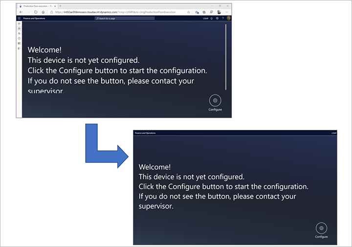

# Gerät zum Ausführen der Produktionsausführungsoberfläche einrichten

[!include [banner](../includes/banner.md)]
[!include [preview banner](../includes/preview-banner.md)]

Die Produktionsausführungsschnittstelle wird für jedes Gerät in der Produktionshalle eingerichtet. Unternehmen richten jedes Gerät in der Regel unterschiedlich ein, je nachdem, welchen Zweck das Gerät erfüllt. Beispielsweise kann ein Unternehmen ein Gerät im Empfangsbereich haben, in dem die Mitarbeiter ein- und ausstempeln, und ein anderes in der Werkstatt, in dem die Mitarbeiter ihre Arbeit erledigen.

## Stellen Sie die Konfiguration und Filter für ein bestimmtes Gerät ein

Um die Konfigurations- und Auftragsfilter für ein Gerät festzulegen, melden Sie sich bei der Seite **Ausführung in der Produktion** mit einem Konto an, das eine Sicherheitsrolle hat, die die Aufgabe *Zeitüberwachung pflegen* enthält. Unter den sofort einsatzbereiten Sicherheitsrollen hat nur der *Werkstattleiter* diese Aufgabe. Dann folgen Sie diesen Schritten.

1. Wechseln Sie zu dem Gerät, das Sie einrichten möchten, und melden Sie sich bei Microsoft Dynamics 365 Supply Chain Management als Werkstattleiter an. (Verwenden Sie ein Konto, das die Aufgabe *Zeitüberwachung pflegen* enthält.)
1. Stellen Sie sicher, dass eine Konfiguration für das Gerät verfügbar ist, das Sie einrichten. Wenn noch keine Konfiguration vorhanden ist, wird eine Standardkonfiguration bereitgestellt. Weitere Informationen zum Einrichten einer Konfiguration finden Sie unter [Konfigurieren Sie die Produktionsausführungsschnittstelle](production-floor-execution-configure.md).
1. Gehen Sie zu **Produktionskontrolle \> Fertigungsausführung \> Ausführung in der Produktion**.

    Wenn die Produktionsausführungsschnittstelle auf dem aktuellen Gerät bereits mindestens einmal konfiguriert wurde, wird eine Anmeldeseite angezeigt. Andernfalls wird eine Begrüßungsseite angezeigt.

1. Wählen Sie entweder auf der Anmeldeseite oder der Begrüßungsseite **Konfigurieren** aus.
1. Wählen Sie in der Liste eine Konfiguration aus.
1. Wählen Sie **Weiter**.
1. Wählen Sie einen oder mehrere Filter aus, die auf das aktuelle Gerät angewendet werden sollen. Diese Filter stellen sicher, dass nur relevante Jobs auf dem Gerät angezeigt werden. Um einen Filter festzulegen, wählen Sie den Filtertyp aus, um eine Liste von Werten zu öffnen, und wählen Sie dann den Wert aus, nach dem gefiltert werden soll. Folgende Filter sind verfügbar:

    - **Produktionseinheit** – Dieser Filter ist der Filter der höchsten Ebene. Er bezieht sich normalerweise auf einen großen Arbeitsbereich, der mehrere Ressourcengruppen und einzelne Ressourcen enthält.
    - **Ressourcengruppe** – Dieser Filter ist ein Filter mittlerer Stufe. Es bezieht sich normalerweise auf eine Sammlung verwandter Ressourcen in einem begrenzten Bereich des Arbeitsbereichs. Wenn Sie zuerst einen **Produktionseinheit**-Filter auswählen, zeigt die Liste der Ressourcengruppen nur Gruppen von dieser Einheit. Andernfalls werden alle verfügbaren Ressourcengruppen angezeigt.
    - **Ressource** – Dieser Filter ist der spezifischste Filter. Er bezieht sich normalerweise auf eine bestimmte Maschine oder eine andere einzelne Ressource. Wenn Sie zuerst einen **Ressourcengruppen** und/oder einen **Produktionseinheits**-Filter auswählen, zeigt die Liste der Ressourcen nur Ressourcen aus dieser Gruppe und/oder Einheit. Sonst werden alle verfügbaren Ressourcen angezeigt.

1. Wählen Sie **OK**.
1. Die Anmeldeseite wird angezeigt und Ihr Gerät ist betriebsbereit.

## Ermöglichen Sie einem Mitarbeiter, die Standardfilter zu überschreiben

Sie können bestimmten Mitarbeitern die Berechtigung erteilen, die Filtereinstellungen auf jedem von ihnen verwendeten Gerät zu ändern. Für Mitarbeiter mit dieser Berechtigung bietet die Produktionsausführungsschnittstelle eine Schaltfläche **Filter** auf den Seite **Alle Jobs** und **Aktiver Job** an.

> [!NOTE]
> Wenn ein Mitarbeiter einen Filter ändert, gilt der neue Filter ab diesem Zeitpunkt für alle Benutzer, die sich am Gerät anmelden.

Führen Sie die folgenden Schritte aus, damit ein Mitarbeiter die für ein Gerät eingerichteten Standardjobfilter überschreiben kann.

1. Gehen Sie zu **Zeit und Anwesenheit \> Einstellungen \> Zeiterfassung für Arbeitskräfte**.
1. Wählen Sie einen Mitarbeiter in der Liste aus, um die Seite **Zeitregistrierungsarbeiter** zu öffnen.
1. Auf der Registerkarte **Zeitregistrierung** stellen Sie die Option **Filter einstellen** auf *Ja*.

## Führen Sie die Benutzeroberfläche im Vollbildmodus aus

Häufig führen Sie die Produktionsausführungsschnittstelle auf einem Gerät aus, das ausschließlich für diesen Zweck verwendet wird. Daher kann es sinnvoll sein, die Benutzeroberfläche im Vollbildmodus auszuführen, ohne dass Navigation und/oder Chrom-Browser angezeigt werden.

- Fügen Sie den folgenden Text am Ende der URL in der Adressleiste des Browsers hinzu, um den in Supply Chain Management angezeigten Navigationsbereich auszublenden: `\&limitednav=true`.
- Verwenden Sie den nativen Vollbildmodus des Browsers, um auch die Adressleiste des Browsers auszublenden. (Anweisungen finden Sie in der Dokumentation Ihres Browsers.)

Der obere Teil der folgenden Abbildung zeigt, wie die Benutzeroberfläche standardmäßig aussieht. Der untere Teil zeigt, wie es im Vollbildmodus aussieht, wenn der Navigationsbereich ausgeblendet ist.

## Verlängern Sie die Sitzung nach 12 Stunden

Standardmäßig wird die Ausführungsoberfläche für die Produktionshalle automatisch abgemeldet, wenn sie 12 Stunden lang von niemandem verwendet wird. Ein Supply Chain Management-Benutzer muss sich dann erneut anmelden. Sie können das Timeout jedoch auf bis zu 90 Tage verlängern.

Um das Timeout zu verlängern, melden Sie sich bei Supply Chain Management an und gehen Sie zu **Systemadministration \> Benutzer \> Sitzungserweiterungen**. Geben Sie das Benutzerkonto für das Supply Chain Management an, mit dem Sie sich am Gerät anmelden, und die Anzahl der Stunden, für die die Sitzung aktiv bleiben soll.
