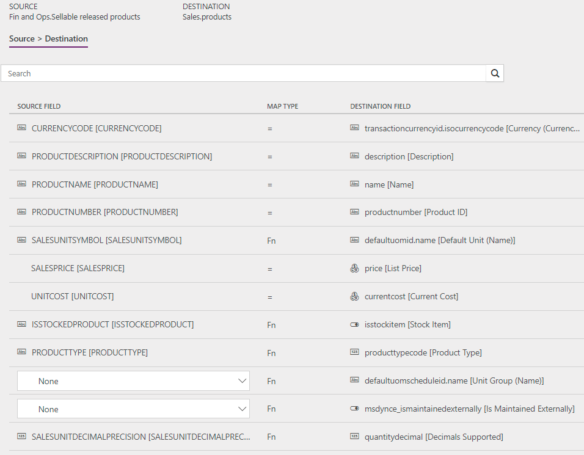

# Produkte direkt von Supply Chain Management mit Produkten in Sales synchronisieren

[!include [banner](../includes/banner.md)]

[!include [rename-banner](~/includes/cc-data-platform-banner.md)]

> [!NOTE]
> Damit Sie die Prospect to Cash-Lösung verwenden können, müssen Sie mit [Integration von Daten in Common Data Service for Apps](https://docs.microsoft.com/powerapps/administrator/data-integrator) vertraut sein.

Dieses Thema beschreibt die Vorlagen und die zugrunde liegende Aufgaben, die verwendet werden, um die Produkte direkt aus Dynamics 365 Supply Chain Management mit Dynamics 365 Sales zu synchronisieren.

## Datenfluss in Interessent nach Bargeld

Die Lösung Interessent nach Bargeld verwendet die Datenenintegrationsfunktion, um Daten über Instanzen von Supply Chain Management und Sales hinweg zu synchronisieren. Die „Interessent zu Bargeld”-Vorlagen, die über die Datenintegrationsfunktion verfügbar sind, ermöglichen den Fluss von Konten, Kontakten, Produkten, Verkaufsangeboten, Aufträgen und Verkaufsrechnungen zwischen Supply Chain Management und Sales. Die folgende Abbildung zeigt, wie Daten zwischen Supply Chain Management und Sales synchronisiert werden.

## Vorlagen und Aufgaben

Um auf die verfügbaren Vorlagen zuzugreifen, öffnen Sie [Power Apps-Administrator-Center](https://admin.powerapps.com/dataintegration). Wählen Sie **Projekte**, und dann auf, in der oberen rechten Ecke, wählen Sie **Neues Projekt**, um öffentliche Vorlagen auszuwählen.

Die folgenden Vorlagen und grundlegenden Aufgaben werden für die Synchronisierung von Konten aus Sales für Kunden in Supply Chain Management verwendet:

- **Name der Vorlage in der Datenintegration:** Produkte (Supply Chain Management zu Sales) - direkt
- **Name der Aufgaben im Datenintegrationsprojekt**: Podukte

Keine Synchronisierungsaufgaben sind erforderlich, damit Produktsynchronisierung auftreten kann.

## Entitätssatz

| Lieferkettenverwaltung    | Verk.    |
|----------------------------|----------|
| Freigegebene Produkte für Verkauf | Produkte |

## Entitätsfluss

Produkte werden in Supply Chain Management verwaltet und mit Sales synchronisiert. Die **Verkäufliche freigegebene Produkte**-Datenentität im Bereich Supply Chain Management exportiert nur Produkte, die *verkäuflich* sind. Verkäufliche Produkte sind Produkte, die die Informationen enthalten, die diese benötigen, damit sie in Aufträgen verwendet werden können. Die gleichen Regeln gelten, wenn ein Produkt mit der Funktion **Überprüfen** auf der Seite **Freigegebenes Produkt** überprüft wird.

Die Produktnummer wird als Schlüssel verwendet. Wenn Produktvarianten mit Sales synchronisiert werden, hat jede eine Produktvariante individuelle Produkt-Kennung

## Prospect to Cash-Lösung für Sales

In Sales wurde ein neues Feld **Wird extern verwaltet** bei Produkten hinzugefügt, um anzugeben, dass ein bestimmtes Produkt extern verwaltet wird. Der Wert wird beim Import nach Sales standardmäßig auf **Ja** festgelegt. Folgende Werte sind verfügbar:

- **Ja** – Das Produkt, stammt aus Supply Chain Management und wird nicht in Sales bearbeitet.
- **Nein** – Das Produkt wurde direkt in Sales eingegeben.
- **(Kein Wert)** – Das Produkt war in Sales vorhanden, bevor der Interessent für Bargeldlösung aktiviert wurde.

Das Feld **Wird extern verwaltet** hilft, sicherzustellen, dass nur Angebote und Aufträge mit Extern verwalteten Produkten mit Supply Chain Management synchronisiert werden.

Extern verwaltete Produkte werden automatisch der ersten gültigen Preisliste mit derselben Währung hinzugefügt. Preislisten sind alphabetisch sortiert nach Name. Der Produktverkaufspreis von Supply Chain Management wird als Preis in der Preisliste verwendet. Vergewissern Sie sich daher, dass Preislisten in Sales für jede Produktverkaufswährung in Supply Chain Management vorhanden sind. Die Währung für die freigegebenen verkäuflichen Produkte ist auf die Buchhaltungswährung in der juristischen Person festgelegt, von der das Produkt exportiert wird.

> [!NOTE]
> - Produktsynchronisierung ist nicht erfolgreich, es sei denn, es gibt eine Liste mit Preisen, die eine entsprechende Währung haben.
> - Sie können die verwendete Preisliste mit der Integration steuern, indem Sie die pricelevelid.name [Standardpreisliste (Name)] im Datenintegrationsprojekt zuordnen. Die Eingabe muss in Kleinbuchstaben sein. Die Vorgabe für eine Preisliste in Sales mit dem Namen „Standard“ wäre zum Beispiel: Zielfeld: pricelevelid.name [Standardpreisliste (Name)] und Zuordnungstyp: [ { „transformType“: „Standard“, „defaultValue“: „Standard“ } ].

## Voraussetzungen und Einrichtung der Zuordnung

- Bevor Sie die allererste Synchronisierung ausführen, müssen Sie die Tabelle eindeutig identifizierbarer Produkte für vorhandene Produkte in Supply Chain Management auffüllen. Vorhandene Produkte werden nicht synchronisiert, bis der Einzelvorgang abgeschlossen ist.

    1. In Supply Chain Management verwenden Sie Suche, um nach **Tabelle eindeutig identifizierbarer Produkte auffüllen** zu suchen.
    2. Klicken Sie auf **Tabelle eindeutig identifizierbarer Produkte auffüllen**, um den Einzelvorgang auszuführen. Dieser Vorgang muss nur einmal aktiviert werden.

- Vergewissern Sie sich, dass die erforderliche Wertzuordnung für die Verkaufsmaßeinheit (ME) zwischen Supply Chain Management und Sales in der Zuordnung von **SalesUnitSymbol** zu **DefaultUnit (Name)** vorhanden ist.
- Aktualisieren Sie Wertzuordnung für **Einheitengruppe** (**defaultuomscheduleid.name**), um den **Einheitengruppen** in Sales zu entsprechen.

    Der Vorlagenwert ist standardmäßig auf **Standardeinheit** festgelegt.

- Stellen Sie sicher, dass alle Maßseinheiten für Produktverkäufe von Supply Chain Management in Sales vorhanden sind.
- Vergewissern Sie sich, dass Preislisten in Sales für jede Produktverkaufswährung in Supply Chain Management vorhanden sind.
- Wenn Produkte in Sales erstellt werden, können sie den Status **Entwurf** oder **Aktiv** besitzen. Das Verhalten wird mit **Einstellungen** > **Verwaltung** > **Systemeinstellungen** > **Verkäufe** in Sales gesteuert.

    Produkte, die den Status **Entwurf** besitzen, wenn sie erstellt werden, müssen aktiviert werden, bevor sie in Anführungszeichen gesetzt oder ausgewählten Aufträgen hinzugefügt werden können.

## Vorlagenzuordnung in Datenintegration

Die folgenden Abbildungen zeigen ein Beispiel für eine Vorlagenzuordnung im Datenintegrator. 

> [!NOTE]
> Die Zuordnung zeigt, welche Feldinformationen von Sales zu Supply Chain Management synchronisiert werden.

## Verwandte Themen

[Prospect-to-Cash](prospect-to-cash.md)

[Konten direkt von Sales mit Konten in Supply Chain Management synchronisieren](accounts-template-mapping-direct.md)

[Kontakte direkt von Sales mit Kontakten oder Debitoren in Supply Chain Management synchronisieren](contacts-template-mapping-direct.md)

[Synchronisieren von Aufträgen direkt zwischen Sales und Supply Chain Management](sales-order-template-mapping-direct-two-ways.md)

[Rechnungskopfzeilen und ‑positionen direkt von Supply Chain Management zu Sales synchronisieren](sales-invoice-template-mapping-direct.md)

