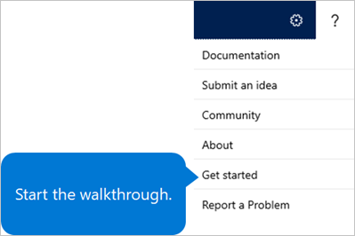

# Onboard-App einrichten

[!include [banner](includes/banner.md)]

Sie können eine Vorführung anzeigen und Microsoft Dynamics 365 Talent: Onboard-App von der [Onboard Produktseite](https://dynamics.microsoft.com/talent/onboard/) testen.

> [!NOTE]
> Die kostenlose Testversion erfordert ein Geschäfts-E-Mail-Konto.

Sie können ein Abonnement von Onboard entweder als Standalone-App oder Teil von Dynamics 365 Talent kaufen. Weitere Informationen dazu, wie Onboard gekauft wird, finden Sie unter [Onord Produktseite](https://dynamics.microsoft.com/talent/onboard/).

Während des Test- oder Einkaufprozesses setzen Sie Ihre Microsoft 365 E-Mail-Adresse und das Kennwort auf. Vergewissern Sie sich, diese Werte zu notieren.

> [!WARNING]
> Sie können keine Daten aus der Testversion auf Ihre bezahlte Abonnementumgebung migrieren. <!--Reviewers: please verify.-->

Um mehr über neue Funktionen im Talent zu erfahren, finden Sie unter [Neuheiten oder Änderungen in Dynamics 365 Talent](./whats-new.md) und [Dynamics 365 und Power Platform-Versionshinweise](https://docs.microsoft.com/business-applications-release-notes/index). Wenn Sie eine Vorschau auf neue Funktionen in Onboard anzeigen möchten, lesen Sie [Zugriffsvorschau-Funktionen in Microsoft Dynamics 365 Talent](./access-preview-feature.md).

Wenn Sie ein IT-Profi sind und mehr darüber erfahren möchten, wie die beiden Versionen der Onboard-App bereitgestellt werden, siehe [Provisionierung für die Dynamics 365 Talent - Onboard-App  (This is an external link)](https://docs.microsoft.com/de-de/dynamics365/supply-chain/talent/modular-app-tech-faq).

## Erste Schritte mit Onboard

Wenn Sie Onboard zum ersten Mal öffnen, werden Sie gebeten, eine Tour durch das Microsoft 365 Administratorencenter machen. Das Administratorcenter ist, wo Sie Ihre Organisation einrichten, Benutzer verwalten und Ihre Daueraufträge verwalten. (Einer dieser einzelnen Daueraufträge ist Ihr Onboard Abonnement.) Weitere Informationen zum Microsoft 365 Administratorencenter finden Sie unter [Info über das Microsoft 365 Administratorencenter](https://docs.microsoft.com/office365/admin/admin-overview/about-the-admin-center?view=o365-worldwide).

Um die Onboard App abzurufen, folgen Sie diesen Schritten.

1. Öffnen Sie die [Microsoft-Anmeldeseite](https://portal.office.com/).
2. Wenn Sie aufgefordert werden, geben Sie Ihre E-Mail-Adresse und das Microsoft 365 Kennwort ein.
3. Wählen Sie das App-Startprogramm am oberen linken Rand, und wählen Sie dann **Dynamics 365** aus.

    

4. Wählen Sie die Kachel **Talent: Onboard**.

    

Die erste Anmeldung kann einige Minuten dauern, da die Umgebung initialisiert werden muss.

## Vorgehensweise testen

Beim ersten öffnen von Onboard können Sie **Startet die exemplarischen Vorgehensweise** auswählen, um mit einer Anzahl Vorlage anzufangen.

Wenn Sie die Exemplarische Vorgehensweise überspringen, können Sie später darauf zugreifen, indem Sie die Schaltfläche **Hilfe** (**?**) auswählen und dann **Erste Schritte** auswählen.

](./media/onboard-start-walkthrough.png)

## Ändern Sie den Domänennamen

Wenn Sie die Standarddomänennamen akzeptiert haben, als Sie sich bei Onboard angemeldet haben, können Sie später auf eine andere Domäne wechseln. (Der Standarddomänenname endet in **onmicrosoft.com**)

1. Öffnen Sie die [Microsoft-Anmeldeseite](https://portal.office.com/).
2. Wenn Sie aufgefordert werden, geben Sie Ihre E-Mail-Adresse und das Microsoft 365 Kennwort ein.
3. Wenn Sie eine Empfehlung finden, die Sie Ihrer eigenen Domäne hinzufügen möchten unter **Empfohlen für Sie** wählen Sie **Empfehlungen anzeigen** und folgen den Aufforderungen. Wenn Sie die Empfehlung nicht sehen, wählen Sie **Alle anzeigen** im Menü links und wählen **Einstellungen**, wählen **Domänen** aus, und wählen entweder **Fügen Sie Domäne hinzu** oder **Kaufen Sie Domäne**. Folgen Sie den Aufforderungen.

## Nächste Schritte

- [Erstellen einer Onboarding-Aneitung](./onboard-create-guide.md)
- [Erstellen einer Onboarding-Vorlage](./onboard-create-template.md)
- [Bearbeiten von Onboarding Anleitungen und Vorlagen](./onboard-edit-guides-templates.md)
- [Hier können Sie Inhalte mit anderen Personen teilen](./onboard-share-template.md)
- [Anzeigen des Status von Aufgaben und dem Onboarding von Mitarbeitern](./onboard-view-status.md)
- [Erstellen von Einstellungsteams in Onboard](./onboard-create-team.md)

### Siehe auch

- [Testen oder kaufen Sie die Onbaord-App](https://dynamics.microsoft.com/talent/onboard/)
- [Was ist neu oder geändert in Dynamics 365 Talent](./whats-new.md)
- [Release-Pläne](https://docs.microsoft.com/business-applications-release-notes/index)
- [Sie erhalten Unterstützung für Microsoft Dynamics 365 Talent](./talent-support.md)
